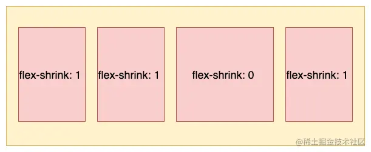

## 概念

Flexbox（弹性盒子布局）是一种用于页面布局的CSS3新特性，它提供了更加灵活和高效的布局方式，特别适用于创建复杂的、响应式的布局结构。Flexbox的主要思想是让容器的子元素能够根据需要自动伸缩，并且能够控制子元素在容器内的对齐、排列方式。


容器默认存在两根轴: 水平的主轴（main axis）和垂直的交叉轴（cross axis）。主轴的开始位置（与边框的交叉点）叫做main start，结束位置叫做main end；交叉轴的开始位置叫做cross start，结束位置叫做cross end。

## 容器属性

### flex-direction

 属性值         | 含义                                                   |
----------------|-----------------------------------------------------|
 row            | 默认值，主轴为水平方向（水平布局），起点在左端，从左向右排列  |
 row-reverse    | 主轴为水平方向（水平布局），起点在右端，从右向左排列         |
 column         | 主轴为垂直方向（垂直布局），起点在上沿，从上往下排列         |
 column-reverse | 主轴为垂直方向（垂直布局），起点在下沿，从下往上排列         |


### flex-wrap

 属性值       | 含义               |
--------------|--------------------|
 nowrap       | 默认值，表示不换行 |
 wrap         | 换行               |
 wrap-reverse | 换行，第一行在下方 |

#### nowrap

默认值，不换行。当主轴的长度是固定并且空间不足时，项目尺寸会随之进行调整，而不会换行


#### wrap

换行，第一行在上面


#### wrap-reverse

换行，第一行在下方。


### flex-flow

即表示flex-direction flex-wrap，默认值为`row nowrap`

### justify-content

属性定义了项目在主轴上的对齐方式。

 属性值        | 含义                                                                 |
---------------|----------------------------------------------------------------------|
 flex-start    | 默认值，左对齐                                                       |
 flex-end      | 右对齐                                                               |
 center        | 居中                                                                 |
 space-between | 两端对齐，项目之间的间隔都相等                                       |
 space-around  | 每个项目两侧的间隔相等。所以，项目之间的间隔比项目与边框的间隔大一倍 |
 space-evenly  | 每个项目之间的间隔相等                                        |


### align-items

属性定义项目在交叉轴上如何对齐

 属性值     | 含义                                                          |
------------|---------------------------------------------------------------|
 flex-start | 交叉轴的起点对齐                                              |
 flex-end   | 交叉轴的终点对齐                                              |
 center     | 交叉轴的中点对齐                                              |
 baseline   | 项目的第一行文字的基线对齐                                    |
 stretch    |（默认值）如果项目未设置高度或设为auto，将占满整个容器的高度 |


### align-content

属性定义了多根轴线的对齐方式。如果项目只有一根轴线，该属性不起作用。

 属性值     | 含义                                                          |
------------|---------------------------------------------------------------|
 flex-start | 交叉轴的起点对齐                                              |
 flex-end   | 交叉轴的终点对齐                                              |
 center     | 交叉轴的中点对齐                                              |
 baseline   | 项目的第一行文字的基线对齐                                    |
 stretch    | （默认值） 如果项目未设置高度或设为auto，将占满整个容器的高度 |

flex-start: 从交叉轴开始位置填充


flex-end: 从交叉轴结尾位置填充


center: 与交叉轴中点对齐


space-between: 与交叉轴两端对齐，轴线之前的间隔平均分布


space-around: 每根轴线两侧的间隔都相等。所以，轴线之间的间隔比轴线与边框的间隔大一倍


stretch默认值，轴线占满整个交叉轴。这里我们先设置每个项目都是固定宽度，效果如下：

下面就去掉每个项目的高度，它会占满整个交叉轴，效果如下:


## 项目属性

### order

order属性用来定义项目的排列顺序。数值越小，排列越靠前，默认为0。使用形式如下:

```css
.item {
    order: <integer>;
}
```


### flex-grow

flex-grow属性定义项目的放大比例，默认为0 ，即如果存在剩余空间，也不放大。

```css
.item {
  flex-grow: <number>; /* default 0 */
}
```

如果所有项目的flex-grow属性都为 1，则它们将等分剩余空间（如果有的话）


如果一个项目的flex-grow属性为2，其他项目都为1，则前者占据的剩余空间将比其他项多一倍。


### flex-shrink

flex-shrink属性定义了项目的缩小比例，默认为 1 ，即如果空间不足，该项目将缩小

```css
.item {
  flex-shrink: <number>; /* default 1 */
}
```

如果所有项目的flex-shrink属性都为 1，当空间不足时，都将等比例缩小。


如果一个项目的flex-shrink属性为 0，其他项目都为 1，则空间不足时，前者不缩小。

负值对该属性无效

### flex-basis

flex-basis属性定义了在分配多余空间之前，项目占据的主轴空间（main size）。浏览器根据这个属性，计算主轴是否有多余空间。它的默认值为auto，即项目的本来大小。

```css
.item {
  flex-basis: <length> | auto; /* default auto */
}
```

它可以设为跟width或height属性一样的值（比如350px），则项目将占据固定空间。
当主轴设置为水平时，当设置了flex-basis，设置的项目宽度值会失效，flex-basis需要跟flex-grow和flex-shrink配合使用才能生效。有两种特殊的值:

- 当flex-basis 值为 0 % 时，项目尺寸会被认为是0，因此无论项目尺寸设置多少都用；
- 当flex-basis 值为 auto 时，则跟根据尺寸的设定值来设置大小。

### flex

flex属性是flex-grow, flex-shrink 和 flex-basis的简写，默认值为0 1 auto。后两个属性可选。

```css
.item {
  flex: none | [ <'flex-grow'> <'flex-shrink'>? || <'flex-basis'> ]
}
```

该属性有两个快捷值auto (1 1 auto) 和 none (0 0 auto)。
建议优先使用这个属性，而不是单独写三个分离的属性，因为浏览器会推算相关值。

(1) 默认值：flex:0 1 auto，即在有剩余空间时，只放大不缩小

```css
.item {
  flex:0 1 auto;
}
.item {
  flex-grow: 0;
  flex-shrink: 1;
  flex-basis: auto;
}
```

(2)flex: none，即有剩余空间时，不放大也不缩小，最终尺寸通常表现为最大内容宽度。

```css
.item {
  flex:0 0 auto;
}
.item {
  flex-grow: 0;
  flex-shrink: 0;
  flex-basis: auto;
}
```

(3)flex: 0，即当有剩余空间时，项目宽度为其内容的宽度，最终尺寸表现为最小内容宽度。

```css
.item {
  flex:0 1 0%;
}
.item {
  flex-grow: 0;
  flex-shrink: 1;
  flex-basis: 0%;
}
```

(4)flex: auto，即元素尺寸可以弹性增大，也可以弹性变小，具有十足的弹性，但在尺寸不足时会优先最大化内容尺寸。

```css
.item {
  flex:1 1 auto;
}
.item {
  flex-grow: 1;
  flex-shrink: 1;
  flex-basis: auto;
}
```

(5)flex: 1，即元素尺寸可以弹性增大，也可以弹性变小，具有十足的弹性，但是在尺寸不足时会优先最小化内容尺寸。

```css
.item {
  flex:1 1 0%;
}
.item {
  flex-grow: 1;
  flex-shrink: 1;
  flex-basis: 0%;
}
```

### align-self

align-self属性允许单个项目有与其他项目不一样的对齐方式，可覆盖align-items属性。默认值为auto，表示继承父元素的align-items属性，如果没有父元素，则等同于stretch。

```css
.item {
  align-self: auto | flex-start | flex-end | center | baseline | stretch;
}
// flex-start: 元素与容器顶部对齐
```


## 参考

[flex布局](https://juejin.cn/post/7245898637779157052?searchId=202403081601259A21A8CDA58336174953#heading-9​​)