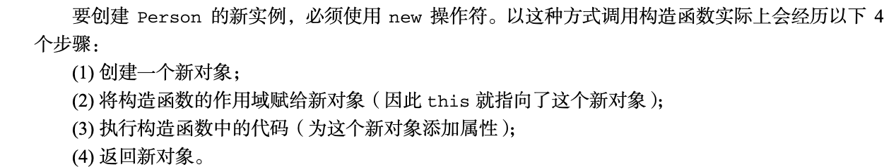

寄生组合继承

通过构造函数继承属性

通过原型链继承方法

```js
class Dog {
    constructor(name: string) {
        this.name = name
    } // 构造函数可以protected，这种情况下只能实例化，无法继承
    // 构造函数可以private，那类既不能实例化也不能被继承
    name: string // 在ts中，属性必须赋初始直，即constructor中的this.name = name ｜ name?:string | name: string = 'wangwang'
    run() {}
    private pri() {} // 私有成员private只能类自己调用，类的实例、子类无法调用
    protected pro() {} // 保护成员只能在子类中调用
    readonly legs: number = 4 // 只读
    static food: string = 'fish' // 静态成员只能通过类名(包括子类)访问，实例无法访问
}

console.log(Dog.prototype) // 类成员的属性都是实例属性，非原型属性，类成员的方法都是原型方法,只能打印出constructor和run方法
let dog = new Dog('wangwang')
console.log(dog) // 只能打印出name
// console.log(dog.pri()) // error,类的私有成员只能类自己调用
// console.log(dog.pro()) // error,类的保护成员只能子类调用
// console.log(dog.food) // error,类的静态成员只能类本身及子类调用，Dog.food、Husky.food

class Husky extends Dog {
    constructor(name: string, color: string) {
        super(name) // 必须super,作用是调用父类的构造函数constructor,子类必须要有父类的name属性
        this.color = color
        // this.pri() // error,类的私有成员只能类自己调用
        this.pro()
    }
    color: string
}

// 类的所有成员属性默认都是public,
```

## new发生了什么？

1. 创建一个新对象
2. 将构造函数的作用域赋值给新对象（因此this就指向了新对象）
3. 执行构造函数中的代码（为这个新对象添加属性）
4. 返回新对象，则返回该对象，否则，返回建的空对象作为thi新创建的对象




