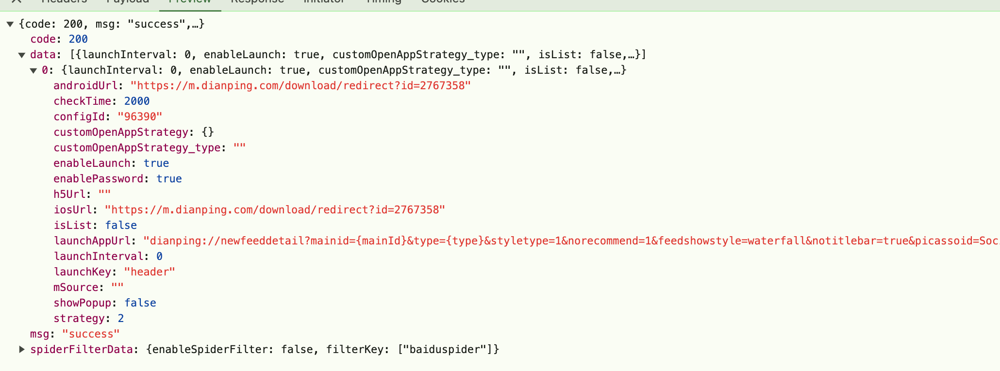
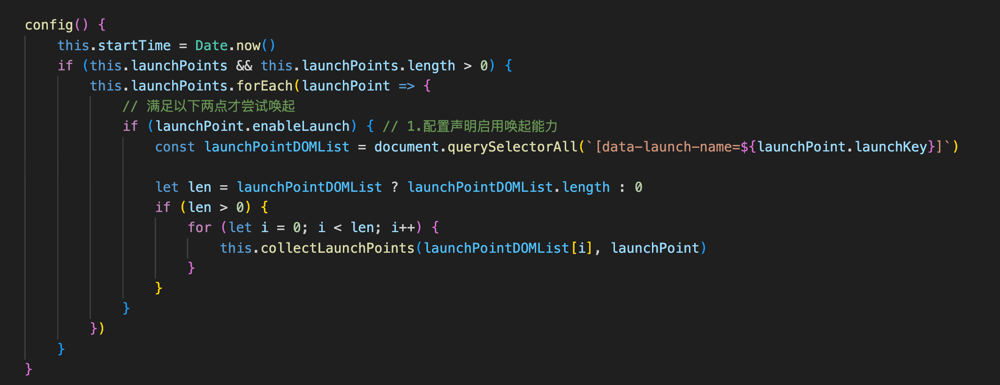
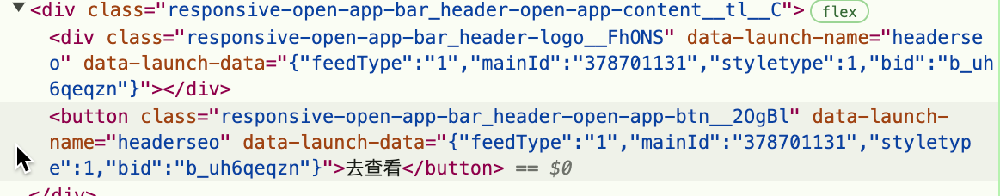
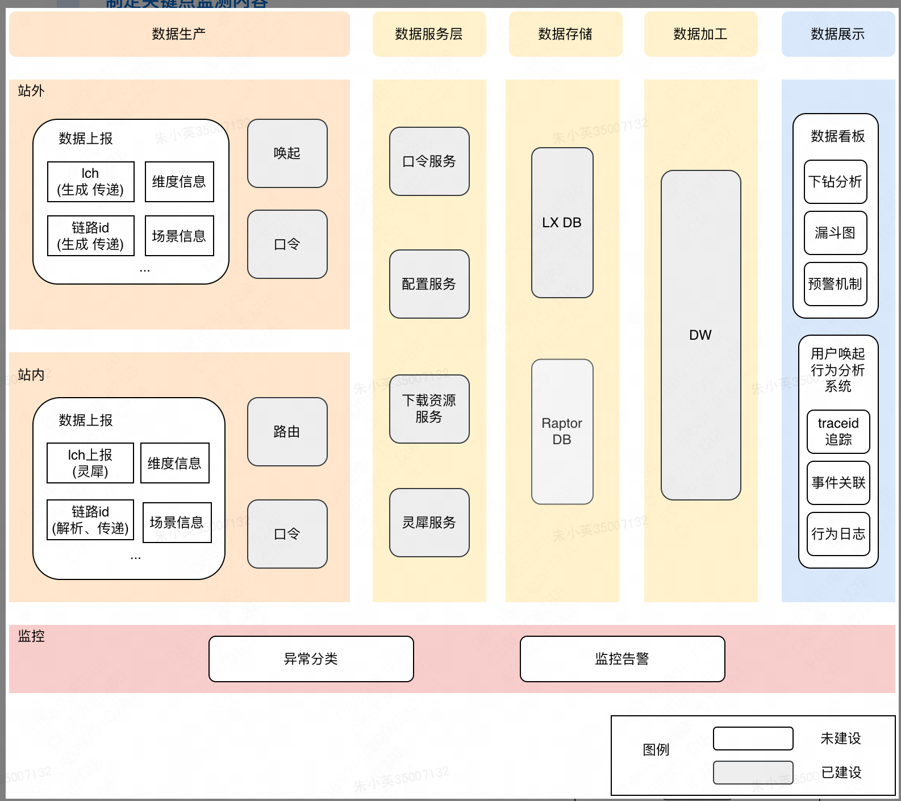
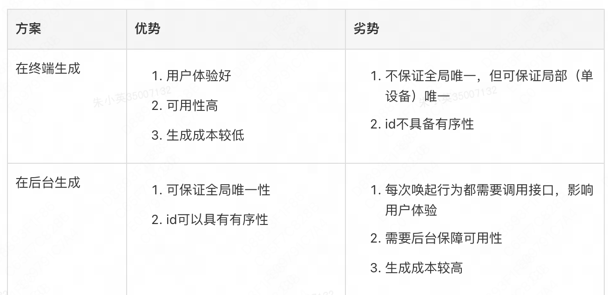
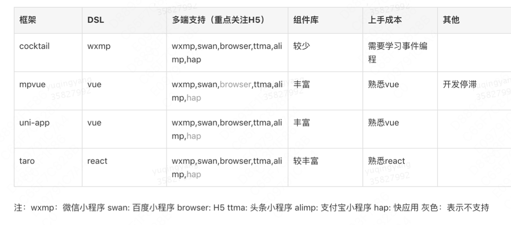
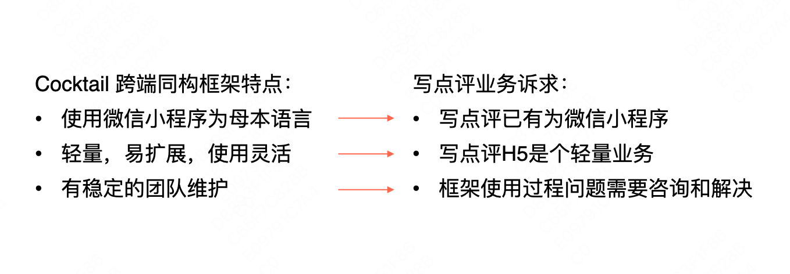

## 个人

### 你的优势是什么？

### 说说你做过的最好的一个项目？

### 你为什么要换工作？

- 在大学毕业已校招生的身份进入美团到现在连续工作了6年多的时间，发现现阶段的工作成长空间有限
- 想换个环境
- 22年生了宝宝，马上要上学了，希望有更多的时间可以陪伴娃，投入到娃的教育上
- 希望自己有更多的时间做一些自己感兴趣的事情，能够一周保持3-4次运动，例如普拉提、瑜伽、游泳，也希望自己有更多的时间可以去探索其他领域的一些技能，例如历史、探索世界、心理学、保险、金融、投资理财
- 自我提升以及

## 城市运营

- 页面布局搭建
  1. SPA
  2. 
- 数据管理: redux
- 登录 && 权限
  1. 各个菜单如何做到权限管理


### 搭建

### 写评价扫码活动sh装饰器@

饰器工厂就是使用一个简单的函数，它返回一个表达式，以供装饰器在运行时调用。需要`tsconfig.json`中配置

```js
function color(value: string) { // 这是一个装饰器工厂
    return function (target) { //  这是装饰器
        // do something with "target" and "value"...
    }
}
```

```json
  "compilerOptions": {
    "experimentalDecorators": true
  }
```

### 微前端

## 唤起

改造节奏： 唤起配置化 -> 唤起链路治理 -> 唤起组件重构

### open-app-manager

#### 背景

1. 接手免费流量运营组的SEO增长组业务时，现状是相关需求一直不断，产品尝试的手段逐渐变多，扩展的终端逐渐变多，入侵的业务逐渐变多。
2. 技术侧：存在以下痛点：1.无法快速高效地响应（20年调整28次，占所有唤起需求将近72%）产品唤起策略修改类需求：部分修改都要手动代码修改，人力成本较高， 2.唤起代码和业务代码耦合度高：增长类需求代码入侵业务代码过多，代码耦合度高随处可见的唤起类代码分散在业务代码的各个地方，存在影响业务基本功能的风险
3. 产品侧：产品规划上需要将站内业务搬到站外去引流，站内业务众多，我们不可能去熟悉各类业务，支持唤起，技术侧期望的合作方式是我们提供组件，业务方接入。

#### 目标

1. 降低唤起需求所需要的人力成本
2. 能快速灵活响应唤起策略调整需求
3. 降低唤起业务与业务本身的耦合程度
4. 可靠、稳定【唤起需求的调整，修改不影响业务页面的基本功能】

#### 谁在使用

适合页面存在大量唤起模块、需要针对安全方面风险、唤起效果验证、需要频繁调整唤起策略、需要将唤起逻辑与业务代码解耦的业务

#### 横向调研

| 应用     | 唤起量 | 唤起实现                                    | 是否使用了配置化 |
|----------|--------|---------------------------------------------|------------------|
| 美团i站  | 少     | 基本的唤起 没有不同渠道唤起不同的业务场景   | 否               |
| 美团外卖 | 无     | 没有唤起 没有不同渠道唤起不同的业务场景     | 否               |
| 小红书   | 中     | 基本的唤起 不同渠道的唤起不同使用硬编码实现 | 否               |
| 今日头条 | 中     | 基本的唤起 没有不同渠道唤起不同的业务场景   | 否               |
| 知乎     | 中     | 基本的唤起 没有不同渠道唤起不同的业务场景   | 否               |

注：

1. 如何看有没有做配置化？看有没有拉取配置的http请求
2. 如何看有没有不同渠道的不同唤起表现？看js代码
3. 如何看有没有使用声明式管理？data声明有没有？

#### 为什么点评站外存在唤起多样化的诉求？

可以从三个维度上解释：

1. 渠道维度：站外产品存在大量投放渠道，不同渠道下，存在对唤起的不同要求
例如：SEO渠道下不允许下载，产品通常使用唤起+下一步的策略，另外还有一些渠道下要求不唤起
2. 产品维度：产品有针对特定渠道进行定制唤起策略的诉求
不同时间下，唤起策略可能不同，例如强度和密度的调整，即存在从产品层面调整唤起策略，实现预期的指标增长的诉求，例如：调整防疲劳策略，调整唤起策略等
3. 环境维度：不同终端环境下，唤起能力存在差异，有根据不同环境定制唤起表现的诉求。
例如在微信中打开时，唤起策略会有所不同，又如iOS下，唤起策略与安卓不同。

#### 实现思路

1. 唤起配置化存在两个运营位，一是唤起参数配置：渠道来源(mSource)、页面标识()、唤起模块(launchKey)、唤起地址、唤起策略、自定义唤起策略、是否支持口令等，二是自定义唤起策略
2. 先获取配置平台的唤起配置相关参数，为了防止网络异常，接口有做重试优化
3. 根据配置的唤起模块使用```document.querySelectorAll(`[data-launch-name=${launchPoint.launchKey}]`)```收集页面上的唤起点，这里需要区分是否列表型节点，如是继续遍历children，否则判断节点是否初始化过inited，否则批量初始化唤起实例，点击时执行对应的唤起策略（唤起、唤起+下载、唤起+下载+下一页、自定义唤起策略：微信环境30分钟3次唤起+下载、微信环境不唤起等），这里面需要考虑自定义唤起策略，需要执行配置化平台上的唤起代码
4. 最后标志该唤起模块已经初始化过

#### 挑战

1. 列表型唤起点如何解决？首先需要接入方在dom节点上表明这是个列表型唤起节点
2. 动态节点如何解决绑定问题?使用js的MutationObserver的API观测DOM节点动态变化,防抖操作
3. 唤起地址存在动态参数如何处理？接入方在参数放在dom节点上，data-launch-data
4. 遇到唤起参数是动态获取的，但是唤起组件会在一开始的时候初始化，怎么解决？需要业务方待参数就绪后再设置唤起属性

#### 结果

1. 能够灵活快速调整唤起策略
2. 人力提效（2 - 0.58）/2 = 71%
3. 唤起代码与业务代码解偶，代码可维护性强

#### 代码片段

```js
handleDynamicDOM() {
    // TODO MutationObserver 能力检测 不支持的polyfill
    const observer = new MutationObserver(debounce(mutationsList => {
        if (mutationsList?.length) {
            this.config() // 绑定唤起实例
            if (this.isRequestError) {
                handleGetDataError()
            }
        }
    }, 500))
    observer.observe(document.body, {
        childList: true,
        subtree: true
    });
}

// 自定义唤起策略执行
customOpenApp(antiFatigueKey, launchPoint, instance, e) {
  const { strategyFunction, strategyConstant } = launchPoint.customOpenAppStrategy
  let dynamicStrategy = new Function('strategyConstant', 'antiFatigueKey', 'logger', strategyFunction)
  try {
    let openAppStrategy = dynamicStrategy(strategyConstant, antiFatigueKey, this.logger)
    if (openAppStrategy && openAppStrategy !== 'noOpen') {
      this.mylog.customOpenApp() // 1201
      if (e) {
      const goToOpen = () => this.goToOpen({ strategy: openAppStrategy }, instance)
      setTimeout0(this.getShowPopupState(launchPoint) ? createOpenAppPopup : goToOpen)
      if (this.getShowPopupState(launchPoint) && e) {
        e.preventDefault()
        e.stopImmediatePropagation()
        return false
      }
    }
  } catch (e) {
    this.mylog.customOpenAppExecError(e)
  }
}}
```

列表型唤起点




### 唤起链路治理

#### 背景

点评增长部的核心指标是App的MAU和新激活量，因此目前点评一个重要的增长策略即为通过站外渠道（微信小程序、M站、百度小程序、头条小程序等）引导用户唤起/下载App。由于各个站外渠道依托的容器（游览器、微信、头条等）存在各种限制，以及App所处操作系统（Android、iOS）底层机制上的差异等问题，在唤起和引导下载方式上，我们设计了多种策略和方式，这要求前端、客户端、数据侧能够在其上达成统一的协议/约定，才能实现唤起跳转、渠道归因等功能。可以看出，整个唤起/下载链路是需要多方配合的，是复杂的，是不稳定的，其中某些环节（用户取消唤起，下载App）对于开发甚至是黑盒，在当前的条件下，想要提前发现问题，定位问题都是困难重重，往往需要耗费产品、前端、客户端、数据侧大量的时间，不仅效率低下，同时关乎用户是否能够进入App体验更好的服务。为此，我们建立了Sundae-唤起链路监控这个项目，希望通过埋点数据补齐，可视化，智能分析等方式让整个唤起/新激活链路变得“透明”，“可控”。

#### 目标

1. 提高排查唤起/新激活链路问题的效率
2. 提高唤起/新激活链路的稳定性
3. 各渠道唤起/新激活数据下降具备预警机制

#### 规划

STEP1:梳理唤起、下载关键路径，制定关键点监测内容
STEP2:各端埋点上报&异常监控，核心页面接入&数据验证
STEP3: 数据可视化&用户行为日志分析，数据波动告警&修复策略

#### 架构图



#### 行动

1. 唤起、下载关键链路上报梳理站外我们自己负责，站内推动客户端同学梳理
2. 调研探索站内外上报方案，日志相关使用logan、数据分析相关使用灵犀埋点
3. 如何将用户从站外到站内的各个链路关联？lch，六段式:scene:cid--bid:channel:customValue:traceid

唤起traceId（lxcuid-timestamp）：176faf46ff4c8-0b22e8def6ef05-326c7006-168000-176faf46ff4c8-1617884980660
口令traceId（lxcuid-timestamp-id）：176faf46ff4c8-0b22e8def6ef05-326c7006-168000-176faf46ff4c8-1617884980558-1A
其中，lxcuid 为cookie中_lxsdk_cuid字段的值（由灵犀sdk设置），timestamp为时间戳，id为2位16进制递增序列字符

#### 调研

#### 日志工具

结论：owl + LX + Raptor 结合使用
站外上报使用：owl, LX, Logan
站内上报使用：LX, Logan，Raptor不做要求

#### 链路id

作用：将用户的行为链路关联、上报数据的关联，只需第一个点上报即可

如何将用户行为链路关联？使用traceid
traceid需要考虑什么？id的唯一性
由谁去生成？前端 or 后端



traceid方案比较


指纹和自主生成的设计和验证成本较大，短期内我们先不考虑这两种方案（即使将来切换方案，成本并不高）。在小程序环境下，openId+时间戳是一个理想的方案，但lxcuid+时间戳也能满足我们对于traceId的要求，并且能够保持统一，因此我们选择利用lxcuid+时间戳的方式。

挑战1:traceid生成方案：由谁生成？如何生成？
挑战2:唤起、口令生成时机不同
挑战3:traceid精度问题

**结论**
首先，口令和唤起无论是单独使用还是叠加使用，都分别需要一个traceId
其次，在不同的终端上，这两个traceId的生成时机和格式有所不同：
小程序中，唤起和口令traceId相同（口令traceId复用唤起traceId），格式为lxcuid+时间戳
H5中，口令和唤起traceId不同，口令请求时生成口令traceId，点击唤起时生成唤起traceId，口令traceId格式为：lxcuid+时间戳+2位16进制自增数字，唤起traceId格式为：lxcuid+时间戳
唤起不太存在同市点击多次的情况、口令是批量生成的，所以为了唯一性，算法精度要求比较高

#### 数据如何验证

为什么需要校验？各个链路存在较多关联逻辑，数仓需要开发，开发即存在bug
校验方案：

1. demo校验，手动操作n次，数据库查询数据是否如预期
2. 相邻节点校验，即按照预期，各个链路间存在漏斗，看结果是否符合预期
3. universal link校验，ulink唤起失败 + ulink唤起成功 <= ulink唤起数

校验发现数仓历史代码有bug

#### 优化

唤起
| 角度             | 方案                       | 任务            |
|----------------|--------------------------|---------------|
| 特定容器环境唤起优化     | 针对低唤起率的机型或者容器进行修复和优化     | 微信            |
| 站内唤起scheme错误检查 | 针对0唤起率的机型或容器进行更多方案的探索    | 百度App(安卓)     |
| 唤起方式优化         | scheme错误导致唤起失败的进行反馈和告警修复 | UC浏览器（ios、安卓） |
| 引导唤起方式探索       | 安卓App Links技术探索          | 大象            |
| 提高唤起兼容性        | 针对不支持唤起的浏览器，出口令弹窗        | 美团App         |

微信治理：

1. 鉴权失败问题 -> 提升包引入时机
2. SPA应用 -> url改变后需重新鉴权
3. 微信聊天消息的情况下不能唤起（只支持卡片唤起） -> ulink

下载
安卓下载使用极简包
下载包进度检测？？未做

口令
复制口令成功率提升？ 未做
App核心页面支持解析？ 推动中

#### 数据

| 站外唤起SDK唤起方式 | 唤起方式占比 | 该方式唤起成功率 |
|-------------|--------|----------|
| intent      | 35.56% | 2.28%    |
| wxOpen      | 23.14% | 45.67%   |
| iframe      | 17.43% | 1.73%    |
| ulink       | 11.88% | 14.17%   |
| aOpen       | 11.56% | 0.11%    |
| href        | 0.72%  | 7.19%    |
| knbCore     | 0.06%  | 4.79%    |

#### 成果

1. 问题排查效率提升
2. 唤起到达率由 至 ，提升，尤其是微信环境，提升效果显著，
   原：唤起SDK启动率99%（过滤不合格url），唤起到达率13%-16%（用户未安装app,取消唤起、封禁等），站内落地页打开成功率95%（url问题）
      微信唤起到达率51%左右
   现： 73%，提升22pp，整体唤起率40%左右，提升25pp

    极简包引入：新激活量提升（212 - 123）/ 123 = 72.4%
3. 通过预警机制，预先发现问题并解决或回滚7例以上

### 唤起组件重构

#### 背景

唤起链路治理的一个手段：组件重构，自2020年初我们接手增长业务以来，增长业务类型越来越多样化，导致对唤起诉求也存在多样性，由于大部分唤起需求都比较紧急，在时间比较紧迫的情况下，我们设计出了满足不同唤起诉求的多个唤起组件，短时间内的开发导致这些组件往往缺乏良好的设计，此外，不同同学开发导致唤起组件代码风格迥异，包缺乏规范化，管理困难等问题。为了更好的服务好业务方以及方便组件的后续管理，我们决定对所有唤起组件进行一次梳理改造，在我们梳理唤起组件的过程中，我们发现多个唤起组件依赖的基础唤起组件存在以下问题：
组件升级成本高：唤起相关类组件繁多，目前一共有6个（@dp/open-app-gestalt：唤起基础组件、@dp/open-app-manager：唤起配置化组件、@dp/open-app-utils：唤起工具类组件、@dp/clip-dp-password：H5口令组件、@dp/launch-app-modal：Safari自动唤起UI组件、@dp/dp-password-popup-h5: h5口令弹窗组件）。唤起基础组件（@dp/open-app-gestalt）升级后，依赖唤起基础组件的多个包都需要相应升级，而这些组件维护在各个不同的项目中，往往需要手动依次升级，改动成本非常高；

包体积大：目前基础唤起组件压缩后的大小为56.1k（未压缩198.7k），体积较大，影响页面性能，导致唤起用户流失；
基础唤起组件扩展性差：为了兼容不同的浏览器，我们使用了if-else的方式调用对应的唤起方法；
灵活性差：不支持业务自定义逻辑；
由于大部分唤起组件都依赖唤起基础组件，所以我们需要优先对唤起基础组件进行重构。

#### 目标

1. 初始化plugins【defaultPlugins包括：url处理、唤起失败、口令生成，以及用户自定义plugins】&初始化唤起实例
2. 提供生命周期：beforeOpenApp、openAppFail[下载、下一页]

#### 行动

1. 编码语言ts+js共存，新组件使用ts
2. 包管理工具：monorepo+lerna
3. 唤起SDK重构【不同的系统支持不同的唤起方式，由原来的if-else通过策略模式改造】参考[唤端技术如何助力双11站外用户转化](https://mp.weixin.qq.com/s/Xe_FnJOu9I4DvU7rQ7xq5w)

降低包体积大小: 使用rollup打包、梳理业务逻辑，删除无关代码由原来的56.1k减少到20.9k，降低62.4%；
唤端行为引入插件模式以及生命周期，支持自定义，例如唤起失败、口令，扩展性强，灵活性高
换端方式采用策略模式，扩展性强

## UGC

### 时间节点

原生微信小程序编写写点评小程序 -> 产品提出需要开发一套H5版本的写点评，特点是几
先有的微信写点评小程序，后需要支持H5版本，主要支持微信、支付宝，功能大致一致，涉及技术选型，如何快速上线？8

### 你是如何技术选型的？


各个维度对比下，维度包括DSL语言、多端支持什么端、组件库、上手成本等，最终选择了平台自研的框架，
这里需要知道cocktai的特点是什么？
- DSL是微信小程序，转换理念是从


富文本解析、表情包

### 写入侧遇到的挑战/难点是什么？又是如何解决的？

安全问题

### XSS攻击是什么？如何避免？

### CSRF攻击是什么？如何避免？

### 内容相关的业务思考？

#### 写入侧
技术层面：安全问题
业务层面：

#### 展示侧

技术层面：如果有SEO的需求技术栈考虑SSR，无则对性能要求比较高的情况下建议SSR

服务库平台是用的什么？

#### seeddesign项目学习

1. demo页支持react、vue查看，页面结构包括组件列表页、组件详情页，其中组件列表页包括顶部title+logo、原子层组件目录、分子层组件，组件详情页包括：组件名称+返回按钮、组件demo ui,技术栈包括react@16.8.1、react-router-dom@5.0.1、webpack@3.12.0，hashRouter，
目录包括：
webpack的配置包括：entry、output、module、pulgins、devServer、externals

2. 角色是什么？

3. 主要负责哪些工作？
   * 产品经理的角色
   * 组件的开发
   * 整包打包
   * 

4. 挑战是什么？
- 如何说服要做这个东西，怎么评估ROI，如何量化？
- 组件很多，靠自己写不现实，如何调动同事的积极性共建，加快项目完成，搞了多久？
  * 组内认领，建议自己写过的+感兴趣的技术项目，绩效的一部份，api评审全组参与，增强参与感，有成长
  * 组外，向上反馈，按组认领，及时push
  * 组件加上归属人，增强开发者的荣誉感
  * 待做：荣誉墙
- 如何推广？
  * 把握机遇，赶上全公司推广星级组件改造，推动整个公司升级我们组件
  * 部门前端群推广 
  * 公司集大前端推广
- 技术上的挑战
  1. svg的方案
- 组件技术方案评审：开发者完成技术文档，内容包括背景、目标、api定义、使用、技术方案，比较复杂的可以开会评审，简单的大家查看文档即可

@seed/react通过build-all-in-one导出思路：package下单独一个react包用于发布@seed/react,index.js用于export所有子包及变量定义， -> 根据文件夹名称获取package下面的所有子包名 -> 遍历各个子包，根据子包下的package.json文件里的main字段获取子包的入口 -> 读取入口文件里的代码，获取代码的export部分(包括组件名以及变量名) -> 更新@seed/react下package.json文件的依赖包及版本号 -> 根据项目的prettier格式将所有子包export出去

TODO
1.SVG如何转换成iconfont
