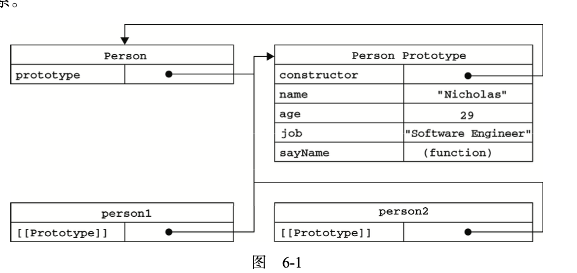

## javascript数据类型

一共有8种，7种基本数据类型以及1种引用数据类型
基本数据类型: null undefined bool string number symbol(ES6新增) binInt(ES6新增)
引用数据类型: object

## 为什么0.1+0.2!==0.3

在 JavaScript（以及大多数编程语言）中，浮点数的表示和计算基于IEEE754标准。这种表示方式会导致一些浮点数运算结果出现精度问题。具体来说，0.1 + 0.2 !== 0.3 的原因在于浮点数在二进制系统中无法精确表示。

在十进制系统中，0.1 和 0.2 可以精确表示，但在二进制系统中，它们是无限循环小数，类似于十进制中的 1/3 表示为 0.333...。具体来说：
```0.1 在二进制中是 0.00011001100110011001100110011...（无限循环）```
```0.2 在二进制中是 0.00110011001100110011001100110...（无限循环）```
由于计算机的存储限制，这些无限循环小数必须被截断，从而引入了精度误差。
当你进行 0.1 + 0.2 运算时，计算机会对这两个截断的二进制数进行加法操作，结果也会受到精度限制。计算结果是一个接近 0.3 的值，但不是精确的 0.3。具体来说：
```console.log(0.1 + 0.2); // 输出: 0.30000000000000004```

解决方法
1.使用整数运算

```js
const a = 0.1 * 100;
const b = 0.2 * 100;
const c = 0.3 * 100;

console.log(a + b === c); // 输出: true
```

2.使用容差值
在进行浮点数比较时，允许一定的误差范围。

```js
const epsilon = Number.EPSILON; // 或者使用一个小的常量值
const result = Math.abs((0.1 + 0.2) - 0.3) < epsilon;

console.log(result); // 输出: true

```

3.使用专门的库
使用专门处理高精度浮点数的库，如 decimal.js 或 big.js。

```js
const Decimal = require('decimal.js');

const a = new Decimal(0.1);
const b = new Decimal(0.2);
const c = new Decimal(0.3);

console.log(a.plus(b).equals(c)); // 输出: true
```

## typeof与instanceof区别

type: 用于检测一个变量的数据类型，返回一个字符串，表示变量的类型，***typeof null为object**

```js
console.log(typeof 42) // "number"
console.log(typeof 'hello') // "string"
console.log(typeof true) // "boolean"
console.log(typeof undefined) // "undefined"
console.log(typeof {name: 'Alice'}) // "object"
console.log(typeof ['Alice', 'Tom']) // "object"
console.log(typeof function(){}) // "function"
console.log(typeof null) // "object" (特殊情况)
console.log(typeof Symbol('symbol')) // "symbol"
console.log(typeof BigInt(123)) // "bigint"

// 数组、对象和null都会判断成object
```

instanceof: 用于检测一个对象是否属于某个构造函数的实例，返回一个布尔值，只能用于对象类型的判断,无法判断基础类型

```js
function Person(name) {
    this.name = name
}

const alice = new Person('Alice')

console.log(alice instanceof Person) // true
console.log(alice instanceof Object) // true
console.log(alice instanceof Array) // false


const arr = [1, 2, 3];
console.log(arr instanceof Array) // true
console.log(arr instanceof Object) // true
```

## 什么是可迭代对象？

## window.onload和$(document).ready区别

## ES6的Proxy的作用是什么？

## ES6的reflect的作用是什么？

## 哪些情况会导致内存泄漏

- 意外的全局变量:由于使用未声明的变量，而意外的创建了一个全局变量，而使这个变量一直留在内存中无法被回收

- 被遗忘的计时器或回调函数:设置了setInterval定时器，而忘记 取消它，如果循环函数有对外部变量的引用的话，那么这个变量会被一直留在内存中，而无法被回收。

- 脱离DOM的引用:获取一个 DOM 元素的引用，而后面这个元素被删除，由于一直保留了对这个元素的引用，所以它也无法被回收。

- 闭包:不合理的使用闭包，从而导致某些变量一直被留在内存当中。

## 原型模式

创建的每个函数都有一个prototype(原型)属性，这个属性是一个指针，指向函数的原型对象，在默认情况下，所有原型对象都会自动获得一个constructor(构造函数)，这个属性包含一个指向prototype属性所在函数的指针。


## 浏览器工作原理，有哪些线程

## Base64是如何编码和解码的？

Base64是一种常见的编码方式，用于将二进制数据转换为ASCII字符串。它通常用于在需要以文本形式传输二进制数据的场景中，例如在电子邮件传输附件、在URL中嵌入二进制数据、或在JSON、XML等文本格式中嵌入图像或文件。Base64 字符表包含64个ASCII字符：a-zA-Z0-0+/

### Base64编码的基本过程如下

1. 将原始二进制数据按每3个字节一组进行处理。
2. 将每组数据分割为4个6 位块。
3. 使用 Base64 字符表将每个 6 位块转换为一个 Base64 字符。
4. 如果原始数据的字节数不是 3 的倍数，则在编码后的字符串末尾添加等号作为填充。

```js
// 假设我们要编码的原始数据是字符串 "Man"。
// 步骤 1：将数据转换为二进制
M: 77 -> 01001101
a: 97 -> 01100001
// 将这些二进制数据拼接起来，并用0补齐至24位：
01001101 01100001 00000000

// 步骤 2：将二进制数据分割为6位块
010011 010110 000100 000000

// 步骤 3：将每个 6 位块转换为 Base64 字符
010011 -> 19 -> T
010110 -> 22 -> W
000100 -> 4  -> E
000000 -> 0  -> A
```

### Base64解码的基本过程如下

1. 如果 Base64 编码的字符串末尾有一个或两个等号（=），则去除填充字符。
2. 将每个 Base64 字符转换为对应的 6 位二进制数。
3. 将所有的 6 位二进制数拼接成一个连续的二进制流。
4. 将连续的二进制流按每 8 位分割成字节。
5. 将每个字节转换为对应的原始数据。

```js
// 假设我们要解码的Base64字符串是"TWE="。
// 步骤 1：去除填充=
TWE

// 步骤 2：将每个 Base64 字符转换为 6 位二进制
T -> 19 -> 010011
W -> 22 -> 010110
E -> 4  -> 000100

// 步骤 3：将二进制数据拼接
010011 010110 000100
// 由于原始数据不足3个字节，我们在最后一个6位块后补两个0：
010011 010110 000100 000000

// 将二进制数据分割为8位块
01001101 01100001 00000000

// 步骤 5：转换为原始数据
01001101 -> 77 -> M
01100001 -> 97 -> a
00000000 -> 0  -> (补齐的 0)
```

## 事件循环Event Loop

浏览器执行顺序：

- 执行同步任务，这属于宏任务，遇见微任务进入微任务队列，遇见宏任务进入宏任务队列
- 当前宏任务执行完出队，检查微任务列表，有则依次执行，直到全部执行完
- 执行浏览器UI线程的渲染工作
- 检查是否有Web Worker任务，有则执行
- 开始下一轮的Event Loop，执行宏任务中的异步代码

微任务包括：MutationObserver、Promise回调例如Promise.then()、Promise.catch()、Promise.finally、Promise为基础开发的其它技术，比如fetch API、V8的垃圾回收过程、Node独有的process.nextTick 、Object.observe（已废弃；Proxy对象替代）
宏任务包括：script、setTimeout、setInterval、setImmediate、I/O、UI rendering、 postMessage、 MessageChannel

## 以下代码的输出结果是什么？

```js
async function async1() {
  console.log("async1 start")
  await async2()
  console.log("async1 end") // 等同于promise.then
}

async function async2() {
  console.log("async2")
}

console.log("script start")

setTimeout(function () {
  console.log("setTimeout")
}, 0)

async1()

new Promise(function (resolve) {
  console.log("promise1")
  resolve();
}).then(function () {
  console.log("promise2")
})

console.log("script end")

// script start
// async1 start
// async2
// promise1
// script end
// async1 end
// promise2
// setTimeout
```

## 常见hash函数

### MD5

特点
输出长度：128 位（16 字节）
速度：快
安全性：由于发现了严重的碰撞漏洞，MD5 已不再被认为安全，不适用于安全敏感的应用。

应用
文件完整性校验
数据校验和验证

```bash
输入: "hello"
输出: "5d41402abc4b2a76b9719d911017c592"
```

### SHA-1

特点
输出长度：160 位（20 字节）
速度：较快
安全性：SHA-1 也已被发现存在碰撞漏洞，不再被认为安全。

应用
早期的安全协议（如 SSL/TLS）
数字签名

### SHA-256

特点
输出长度：256 位（32 字节）
速度：较慢于 MD5 和 SHA-1，但更安全
安全性：目前被认为是安全的

应用
安全协议（如 SSL/TLS）
数字签名
区块链

## 按要求实现以下功能

实现前端一个并发请求控制函数
1.输入URL数组和限制请求数
2.按照限制请求数控制前端同时可以并发请求数量
3.请求操作直接用window.fetch

```js
// Example usage
const urls = [
    'https://api.example.com/data1',
    'https://api.example.com/data2',
    'https://api.example.com/data3',
    // Add more URLs as needed
];

const limit = 2;

async function concurrentRequests(urls, limit) {
    const results = [];
    const inFlightRequests = [];
    
    async function makeRequest(url) {
        try {
            const response = await fetch(url);
            const data = await response.json();
            results.push(data);
        } catch (error) {
            results.push({ error: error.message });
        }
    }
    
    for (let i = 0; i < urls.length; i++) {
        const request = makeRequest(urls[i]);
        inFlightRequests.push(request);
        
        if (inFlightRequests.length === limit || i === urls.length - 1) {
            await Promise.all(inFlightRequests);
            inFlightRequests.length = 0;
        }
    }
    
    return results;
}

concurrentRequests(urls, limit)
    .then(results => console.log(results))
    .catch(error => console.error(error));
```

## tostring和String方法的区别

### 调用方式

toString() 是对象的方法，需要通过对象实例调用。
String() 是全局函数，可以直接调用。

### 适用范围

toString()不能用于null和undefined，会抛出错误。
String()可以用于任何类型，包括null和undefined。

### 默认行为

toString() 方法在对象没有重写toString()方法时会返回默认的字符串表示（如 [object Object]）
String()函数会将传入的值转换为字符串，如果是对象则会调用该对象的toString()方法