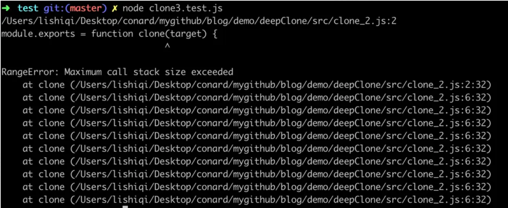
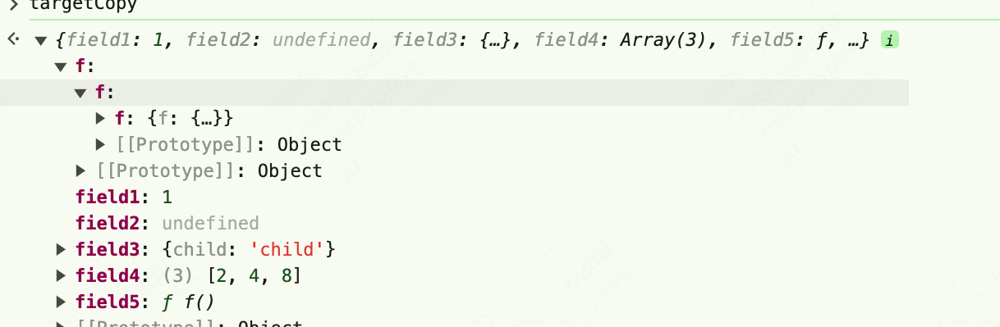
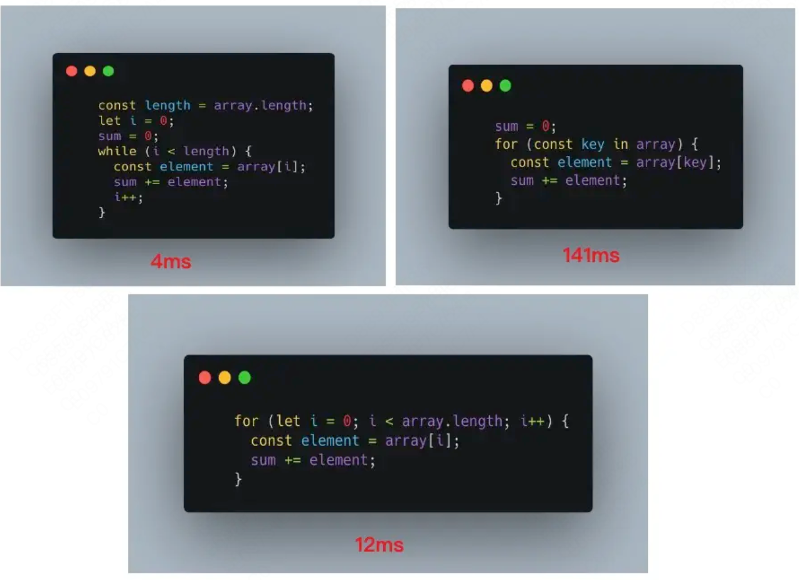

## 传递方式

值传递：基本类型采用的是值传递

```js
let a = 10;
let b = a; 
b++;
console.log(a, b) // 输出10 11
```

地址传递：引用类型则是地址传递，将存放在栈内存中的地址赋值给接收的变量。

```js
let a = { x: 1 }
let b = a
b.x = 2
console.log(a, b) // 输出{x: 2} {x: 2}
```

## 浅拷贝例子

### Object.create(x)

```js
let a = {
    name: '小黑子'
}
let b = Object.create(a)
console.log(b.name) // 小黑子， 会隐式继承原对象的属性
a.name = '大黑子'
console.log(b.name) // 大黑子
```

### Object.assign({}, x)

```js
let a = {
    name: '小黑子',
    hobby: {
        n: 'running'
    }
}
let b = Object.assign({}, a)
a.hobby.n = 'coding'
console.log(b.hobby.n) // coding
```

### concat

```js
let arr = [1, 2, 3, {a: 10}]
let newArr = [].concat(arr)
arr[3].a = 1
console.log(newArr) // [ 1, 2, 3, { a: 1 } ]
```

### slice

```js
let arr = [1, 2, 3, {a: 10}]
let newArr = arr.slice(0)
// 只有一个参数0，也就是提取整个数组
arr[3].a = 1
console.log(newArr) // [ 1, 2, 3, { a: 1 } ]
```

### 数组解构

```js
let arr = [1, 2, 3, {a: 10}]
let newArr = [...arr]
arr[3].a = 1
console.log(newArr) // [ 1, 2, 3, { a: 1 } ]
```

## 深拷贝

### JSON.stringify

**拷贝的对象的值中如果有函数、undefined、symbol 这几种类型，经过 JSON.stringify 序列化之后的字符串中这个键值对会消失；**
**拷贝Date引用类型会变成字符串；**
**无法拷贝不可枚举的属性；**
**无法拷贝对象的原型链；**
**拷贝RegExp引用类型会变成空对象；**
**对象中含有NaN、Infinity以及-Infinity，JSON 序列化的结果会变成null；**
**无法拷贝对象的循环应用，即对象成环 (obj[key] = obj).**

```js
let obj = {
    name: '小黑子',
    age: 18,
    hobby: {
        type: 'coding'
    },
    a: undefined,
    b: null,
    c: function() {},
    d: {
        n: 100
    },
    e: Symbol('hello')
}
console.log(JSON.stringify(obj)); // {"name":"小黑子","age":18,"hobby":{"type":"coding"},"b":null,"d":{"n":100}}
```

## 浅拷贝实现

```js
function shalldowClone(target){
    // 只拷贝引用类型
    if(typeof target !== 'object' || target == null) return target
    let targetCopy = Array.isArray(target) ? [] : {}
    for(let key in target){
        // 不要隐式
        if(target.hasOwnProperty(key)){
            // objCopy.key是个字符串,[]可以当成变量
            targetCopy[key] = target[key]
        }
    }
    return targetCopy
}
```

## 深拷贝实现

```js
function deepClone(obj){
    if(typeof target !== 'object' || target == null) return target
    let targetCopy = Array.isArray(target) ? [] : {}
    for(let key in target){
        // 不要隐式
        if(target.hasOwnProperty(key)){
            // objCopy.key是个字符串,[]可以当成变量
            targetCopy[key] = deepClone(target[key])
        }
    }
    return targetCopy
}
```

循环引用

```js
const target = {
    field1: 1,
    field2: undefined,
    field3: {
        child: 'child'
    },
    field4: [2, 4, 8]
};
target.target = target;
```

可以看到下面的结果：



很明显，因为递归进入死循环导致栈内存溢出了。针对这种情况的解决方案是可以额外开辟一个存储空间，来存储当前对象和拷贝对象的对应关系，当需要拷贝当前对象时，先去存储空间中找，有没有拷贝过这个对象，如果有的话直接返回，如果没有的话继续拷贝。我们可以选择Map这种数据结构：

检查map中有无克隆过的对象

- 有 - 直接返回

- 没有 - 将当前对象作为key，克隆对象作为value进行存储

继续克隆

```js
function deepClone(target, map = new Map()) {
  if (typeof target === 'object' || typeof target === 'function' || target === null ) return target
  let targetCopy = Array.isArray(target) ? [] : {}
  if (map.has(target)) return target
  map.set(target, targetCopy)
  for (let key in targetCopy) {
    if (target.hasOwnProperty(key)) {
      targetCopy[key] = deepClone(target[key])
    }
  }
  return targetCopy
}

// 以上Map可以用WeakMap做优化，WeakMap中的key是弱引用，差别可见https://segmentfault.com/a/1190000020255831?u_atoken=5f056195-4e25-4102-bf4d-34759c002cf6&u_asig=2760822017189540453518785eac30&u_aref=QQ5gGW8fS2LWQwcdne4ZDAfoDgw%3D
// function clone(target, map = new WeakMap()) {
    // ...
// };
```

```js
// 输入
function f () {const a = 1}
const target = {
    field1: 1,
    field2: undefined,
    field3: {
        child: 'child'
    },
    field4: [2, 4, 8],
    field5: f,
    f: { f: { f: { f: { f: { f: { f: { f: { f: { f: { f: { f: {} } } } } } } } } } } },
};

const targetCopy = deepClone(target)
```

输出



## 性能优化

在上面的代码中，我们遍历数组和对象都使用了for in这种方式，实际上for in在遍历时效率是非常低的，我们来对比下常见的三种循环for、while、for in的执行效率：



可以看到，while的效率是最好的，所以，我们可以想办法把for in遍历改变为while遍历。

参考

[](https://segmentfault.com/a/1190000020255831?u_atoken=5f056195-4e25-4102-bf4d-34759c002cf6&u_asig=2760822017189540453518785eac30&u_aref=QQ5gGW8fS2LWQwcdne4ZDAfoDgw%3D)
[](https://juejin.cn/post/7302348032543850508)