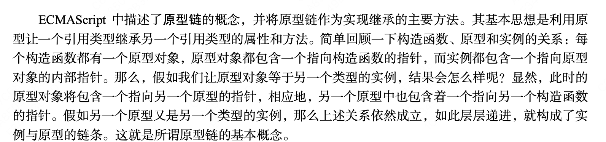

## 原型链模式

简单回顾下构造函数、原型和实例的关系：每个构造函数都有一个原型对象，原型对象都包含一个指向构造函数的指针，而实例都包含一个指向原型对象的内部指针。那如果让原型对象等于另一个类型的实例。


思路：原型对象上的所有属性和方法都可以被实例共享

```js
function SuperType(){
    this.property = true
}
SuperType.prototype.getSuperValue = function() {
    return this.property
}

function SubType(){
    this.subproperty = false
}
//继承了 SuperType
SubType.prototype = new SuperType()
SubType.prototype.getSubValue = function (){
    return this.subproperty
}

var instance = new SubType()
alert(instance.getSuperValue()) //true
```

本质：重写了原型对象方式，将父对象的属性方法作为自对象原型对象的属性方法，同时重写构造函数
优点：所有对象实例可共享原型对象所包含的属性和方法
缺点：
1.包含引用类型值的原型属性会被所有实例共享
2.在创建子类型的实例时，不能向超类型的构造函数中传递参数

***注意：通过原型链实现继承时，不能使用对象字面量创建原型方法。因为这样会重写原型链**

```js
function SuperType(){
    this.property = true
}
SuperType.prototype.getSuperValue = function() {
    return this.property
}

function SubType(){
    this.subproperty = false
}
//继承了 SuperType
SubType.prototype = new SuperType()
SubType.prototype.constructor = SubType

// 使用字面量添加新方法，会导致上一行代码无效！！
SubType.prototype = {
    getSubValue: function () {
        return this.subproperty
    },
    someOtherMethod: function (){
        return false
    }
}

var instance = new SubType()
alert(instance.getSuperValue()) // error
```

## 构造函数

思路：在子类的构造函数内部调用父类的构造函数

```js
function SuperType(name){
    this.name = name
}
SuperType.prototype.getSuperValue = function() {
    return this.property
}
function SubType(name){
    //继承了 SuperType，同时还传递了参数 
    SuperType.call(this, name)
    //实例属性
    this.age = 29
}
var instance = new SubType("Nicholas")
alert(instance.name)    //"Nicholas"
alert(instance.age);    //29
```

缺点：原型链上的共享方法无法读取继承

## 组合继承

实现思路：构造函数模式用于定义实例属性，而原型模式用于定义方法和共享的属性。结果，每个实例都会有自己的一份实例属性的副本，但同时又共享着对方法的引用，最大程度的节省了内存。另外，这种混合模式还支持向构造函数传递参数。

```js
function SuperType(name){
    this.name = name
    this.colors = ["red", "blue", "green"];
}
SuperType.prototype.sayName = function(){
    alert(this.name)
}

function SubType(name, age){
    //继承属性 
    SuperType.call(this, name) // 第二次调用SuperType()
    this.age = age
}
//继承方法
SubType.prototype = new SuperType() // 第一次调用SuperType()
SubType.prototype.constructor = SubType
SubType.prototype.sayAge = function(){
    alert(this.age)
}

var instance1 = new SubType("Nicholas", 29)
instance1.colors.push("black")
alert(instance1.colors) // "red,blue,green,black"
instance1.sayName() // "Nicholas"
instance1.sayAge() // 29

var instance2 = new SubType("Greg", 27)
alert(instance2.colors) // "red,blue,green"
instance2.sayName() // "Greg"
instance2.sayAge() // 27
```

缺点：无论什么情况下，父类构造函数会调用2次，一次是在创建子类原型的时候（SubType.prototype = new SuperType()），另一次是在子类型构造函数内部（SuperType.call(this, name)）

## 寄生组合继承

```js
function SuperType(name){
    this.name = name
    this.colors = ["red", "blue", "green"];
}
SuperType.prototype.sayName = function(){
    alert(this.name)
}

function SubType(name, age){
    //继承属性 
    SuperType.call(this, name)
    this.age = age
}
//继承方法
SubType.prototype = Object.create(SuperType.prototype)
SubType.prototype.constructor = SubType
SubType.prototype.sayAge = function(){
    alert(this.age)
}
```

## 如何实现多重继承

```js
function SuperType(name){
    this.name = name
    this.colors = ["red", "blue", "green"];
}
SuperType.prototype.sayName = function(){
    alert(this.name)
}

function SuperKind(kind) {
    this.kind = kind
}
SuperKind.prototype.sayKind = function(){
    alert(this.kind)
}

function SubType(name, kind){
    //继承属性 
    SuperType.call(this, name)
    SuperKind.call(this, kind)
}
//继承方法
SubType.prototype = Object.create(SuperType.prototype)
Object.assing(SubType.prototype, SuperKind.prototype)
SubType.prototype.constructor = SubType
```