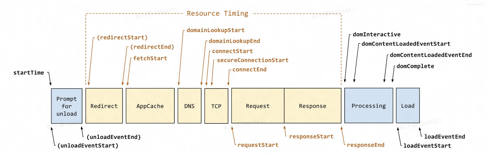

## performance.timing对象属性属性含义

### navigationStart

当前浏览器窗口的前一个网页关闭，发生unload事件时的Unix毫秒时间戳。如果没有前一个网页，则等于fetchStart属性。

### unloadEventStart

前一页面卸载开始，如果前一个网页与当前网页属于同一个域名，则返回前一个网页的unload事件发生时的Unix毫秒时间戳。如果没有前一个网页，或者之前的网页跳转不是在同一个域名内，则返回值为0。

### unloadEventEnd

前一页面卸载结束，如果前一个网页与当前网页属于同一个域名，则返回前一个网页unload事件的回调函数结束时的Unix毫秒时间戳。如果没有前一个网页，或者之前的网页跳转不是在同一个域名内，则返回值为0。

### redirectStart

重定向开始，返回第一个HTTP跳转开始时的Unix毫秒时间戳。如果没有跳转，或者不是同一个域名内部的跳转，则返回值为0。

### redirectEnd

重定向结束，返回最后一个HTTP跳转结束时（即跳转回应的最后一个字节接受完成时）的Unix毫秒时间戳。如果没有跳转，或者不是同一个域名内部的跳转，则返回值为0。

### fetchStart

页面开始加载，返回浏览器准备使用HTTP请求读取文档时的Unix毫秒时间戳。该事件在网页查询本地缓存之前发生。

### domainLookupStart

DNS查询开始，返回域名查询开始时的Unix毫秒时间戳。如果使用持久连接，或者信息是从本地缓存获取的，则返回值等同于fetchStart属性的值。

### domainLookupEnd

DNS查询结束，返回域名查询结束时的Unix毫秒时间戳。如果使用持久连接，或者信息是从本地缓存获取的，则返回值等同于fetchStart属性的值。

### connectStart

SSL连接开始，返回HTTP请求开始向服务器发送时的Unix毫秒时间戳。如果使用持久连接（persistent connection），则返回值等同于fetchStart属性的值。

### secureConnectionStart

返回浏览器与服务器开始安全链接的握手时的Unix毫秒时间戳。如果当前网页不要求安全连接，则返回0。

### connectEnd

SSL连接结束，返回浏览器与服务器之间的连接建立时的Unix毫秒时间戳。如果建立的是持久连接，则返回值等同于fetchStart属性的值。连接建立指的是所有握手和认证过程全部结束。

### requestStart

开始请求页面文档，返回浏览器向服务器发出HTTP请求时（或开始读取本地缓存时）的Unix毫秒时间戳。

### responseStart

首字节时间，返回浏览器从服务器收到（或从本地缓存读取）第一个字节时的Unix毫秒时间戳。

### responseEnd

结束请求页面文档，返回浏览器从服务器收到（或从本地缓存读取）最后一个字节时（如果在此之前HTTP连接已经关闭，则返回关闭时）的Unix毫秒时间戳。

### domLoading

DOM 开始加载，返回当前网页DOM结构开始解析时（即Document.readyState属性变为loading、相应的readystatechange事件触发时）的Unix毫秒时间戳。

### domInteractive

DOM 解析结束，返回当前网页DOM结构结束解析、开始加载内嵌资源时（即Document.readyState属性变为interactive、相应的readystatechange事件触发时）的Unix毫秒时间戳。

### domContentLoadedEventStart

开始加载远程资源，返回当前网页DOMContentLoaded事件发生时（即DOM结构解析完毕、所有脚本开始运行时）的Unix毫秒时间戳。

### domContentLoadedEventEnd

DOM Ready时间，返回当前网页所有需要执行的脚本执行完成时的Unix毫秒时间戳。

### domComplete

资源全部准备就绪（含异步），返回当前网页DOM结构生成时（即Document.readyState属性变为complete，以及相应的readystatechange事件发生时）的Unix毫秒时间戳。

### loadEventStart

页面完全加载时间，返回当前网页load事件的回调函数开始时的Unix毫秒时间戳。如果该事件还没有发生，返回0。

### loadEventEnd

onload回调函数结束，返回当前网页load事件的回调函数运行结束时的Unix毫秒时间戳。如果该事件还没有发生，返回0。

## 测速阶段统计方式

参考：https://km.sankuai.com/page/145683988

## 网页加载的核心指标

### 首字节时间-responseStartTime

指浏览器接收到 HTML 文档第一个字节的时间。此时间点之前，浏览器需要经过 DNS解析、重定向(若有)、建立 TCP/SSL 连接、服务器响应等过程。
反映的问题：服务器、CDN 性能
对应测速点：responseStart

### DOM构建完成时间/可交互时间-domInteractiveTime

HTML 解析器完成 DOM 树构建的时间。此时间点之前，浏览器需要经过同步静态资源加载、内联 JavaScript 脚本运行、HTML 解析器生成 DOM 树的过程。此时网页变成可交互状态，到此为止便是网页的可交互时间。用户可以进行正常的事件输入交互操作。
反映问题：前端代码执行性能，加载策略
对应测速点：domInteractive

### DOM Ready时间

CSS树和DOM树合并渲染树后，并执行完成同步 JavaScript 脚本的时间。此时间点之前，包含了DOM树构建的过程、CSS树构建的过程、以及同步 JavaScript 脚本执行的时间。
反映问题：css资源阻塞
对应测速点：domContentLoadedEventEnd

### 首屏时间

首屏时间是指浏览器从响应用户输入网络地址，到首屏内容渲染完成的时间。 但是基于加载指标类的数据采集，不足以验证页面的真实性能，结合感官可使用的首屏的时间，来作为首屏时间。
详细内容可见首屏时间定义及计算方式。

### 完全加载时间

DOM Tree 构建完成后，开始加载网页资源，资源完全加载完成的时间。此时会触发浏览器 onload 事件。
反映的问题：资源加载问题、前端代码性能
计算方式：loadEventStart

## 优化思路

分析思路，慢的原因是什么？

- 服务器响应慢
- 阻断渲染的js/css
- 资源加载时间长
- 客户端渲染机器影响

优化方案

- 服务器优化：缓存html页面、页面资源，减少浏览器直接请求资源 => 缓存机制（面试）
- 图片优化：采用不同图片格式等，减少图片体积，提高图片加载速度
- 代码优化：重构、压缩、注释过滤
- 使用cdn
- 渲染阻断优化：

## 性能分析工具

1、前端监控：owl、raptor等
2、常见工具：Chrome Performance、https://km.sankuai.com/page/120790337?searchid=951976494、WebPageTest、PageSpeed

文档加载过程
文档渲染呈现过程
交互过
文档加载过程： 
DCL：空白到出现内容所花费的时间 
渲染呈现过程：
FP&FCP：首次绘制（FP，可能是背景色或loading），首次内容绘制时间（FCP）
FMP：首要内容出现在屏幕上的时间
LCP：视窗内最大的元素绘制的时 
交互过程：
TTI：网页首次完全达到可交互状态的时间点 
FPS：每秒可以重新绘制的帧数，用于衡量应用流畅度