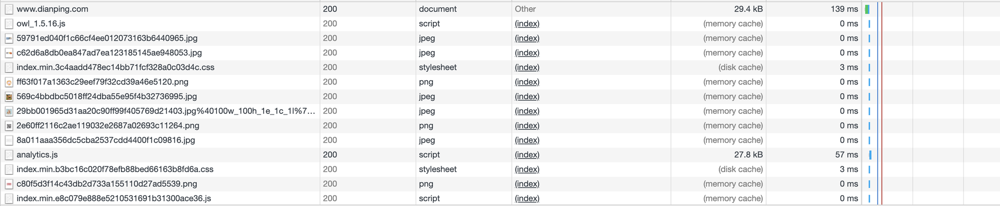
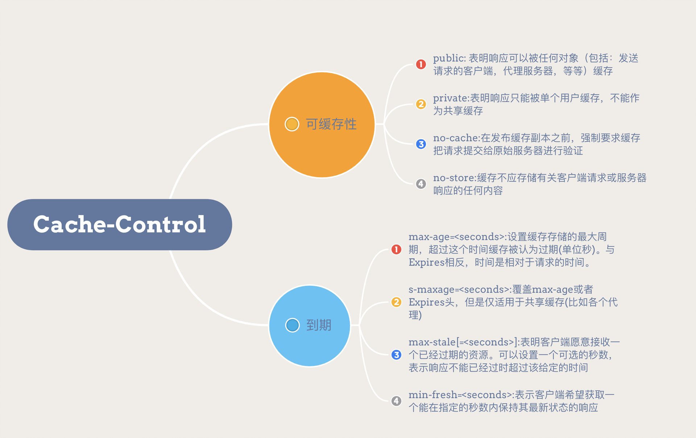

## 缓存位置



从缓存位置上来说分为四种，并且各自有优先级，当依次查找缓存且都没有命中的时候，才会去请求网络。

- Service Worker
- Memory Cache
- Disk Cache
- Push Cache

### Service Worker

Service Worker 是运行在浏览器背后的独立线程，一般可以用来实现缓存功能。使用 Service Worker 的话，传输协议必须为 HTTPS。因为 Service Worker 中涉及到请求拦截，所以必须使用 HTTPS 协议来保障安全。***Service Worker 的缓存与浏览器其他内建的缓存机制不同，它可以让我们自由控制缓存哪些文件、如何匹配缓存、如何读取缓存，并且缓存是持续性的**。

Service Worker 实现缓存功能一般分为三个步骤：首先需要先注册 Service Worker，然后监听到 install 事件以后就可以缓存需要的文件，那么在下次用户访问的时候就可以通过拦截请求的方式查询是否存在缓存，存在缓存的话就可以直接读取缓存文件，否则就去请求数据。

当 Service Worker 没有命中缓存的时候，我们需要去调用 fetch 函数获取数据。也就是说，如果我们没有在 Service Worker 命中缓存的话，会根据缓存查找优先级去查找数据。但是不管我们是从 Memory Cache 中还是从网络请求中获取的数据，浏览器都会显示我们是从 Service Worker 中获取的内容。

### Memory Cache

Memory Cache（内存缓存），主要包含的是当前页面中已经抓取到的资源，例如页面上已经下载的样式、脚本、图片等。读取内存中的数据肯定比磁盘快，内存缓存虽然读取高效，可是缓存持续性很短，会随着进程的释放而释放（一旦我们关闭 Tab 页面，内存中的缓存也就被释放了）。

内存缓存中有一块重要的缓存资源是 preloader 相关指令（例如<link rel="prefetch">）众所周知 preloader 的相关指令已经是页面优化的常见手段之一，它可以一边解析 js/css 文件，一边网络请求下一个资源。

需要注意的事情是，***内存缓存在缓存资源时并不关心返回资源的 HTTP 缓存头 Cache-Control 是什么值，同时资源的匹配也并非仅仅是对 URL 做匹配，还可能会对 Content-Type，CORS 等其他特征做校验。**

### Disk Cache

Disk Cache 也就是存储在硬盘中的缓存，读取速度虽然慢点，但是什么都能存储到磁盘中，与 Memory Cache 相比，优势是容量和存储时效性。

在所有浏览器缓存中，Disk Cache 覆盖面基本上是最大的。它会根据 HTTP Header 中的字段判断哪些资源缓存（不用慌，关于 HTTP 的协议头中的缓存字段，会在下面详细介绍的），哪些资源可以不请求直接使用，哪些资源已经过期需要重新请求。并且即使在跨站点的情况下，相同地址的资源一旦被硬盘缓存下来，就不会再次去请求数据。绝大部分的缓存都来自 Disk Cache。

***浏览器会把哪些文件丢进内存中？哪些丢进硬盘中？**关于这点，网上说法不一，不过以下观点比较靠得住：
对于大文件来说，大概率是不存储在内存中的，反之优先；
当前系统内存使用率高的话，文件优先存储进硬盘。

### Push Cache

Push Cache（推送缓存）是HTTP/2中的内容，当以上三种缓存都没有命中时，它才会被使用。***它只在会话（Session）中存在，一旦会话结束就被释放，并且缓存时间也很短暂**。

Push Cache 在国内能够查到的资料很少，也是因为 HTTP/2 在国内不够普及。这里推荐阅读Jake Archibald的 HTTP/2 push is tougher than I thought 这篇文章，文章中的几个结论：

- 所有的资源都能被推送，并且能够被缓存, 但是 Edge 和 Safari 浏览器支持相对比较差；
- 可以推送 no-cache 和 no-store 的资源；
- 一旦连接被关闭，Push Cache 就被释放；
- 多个页面可以使用同一个 HTTP/2 的连接，也就可以使用同一个 Push Cache。这主要还是依赖浏览器的实现而定，出于对性能的考虑，有的浏览器会对相同域名但不同的 tab 标签使用同一个 HTTP 连接；
- Push Cache 中的缓存只能被使用一次；
- 浏览器可以拒绝接受已经存在的资源推送；
- 你可以给其他域名推送资源。
如果以上四种缓存都没有命中的话，那么只能发起请求来获取资源了。

## 缓存类型

### 缓存对象

通常 HTTP 缓存只适用于 idempotent request（可以理解为查询请求，也就是不更新服务端数据的请求），缓存的对象通常是 html文件、css、js、图片等通过 GET 请求返回的资源文件；
如下图浏览器第一次发起对 /index.html 的请求：

1. 由于本地缓存为空，浏览器直接向服务器发起请求；
2. 服务器返回响应，并设置了一些响应头来控制资源在浏览器的缓存行为；
3. 浏览器收到请求，将响应头与资源一起缓存，并将资源用于页面展示；


通常在本地无禁止缓存的配置请款下，缓存是浏览器的默认行为。所以 HTTP 缓存体系更多的内容是对缓存校验，防止缓存并使用已经过期的资源。

### 强缓存

#### Expires

```shell
Expires: Wed, 22 Oct 2020 08:41:00 GMT
```

Expires是 HTTP/1.0 的产物，表示资源会在 Wed, 22 Oct 2022 08:41:00 GMT 后过期。这里注意一下，Expires返回的是服务器设定的时间，Expires控制缓存是通过客户端和服务端的时间进行对比，倘若时间因为某些原因（比如：修改了本地之间或者因为时区的问题发生误差会导致缓存失效。

#### Cache-Control

Cache-Control是HTTP/1.1的产物


##### 优先级

如果两者同时存在的话，Cache-Control的优先级大于Expires，如果在不支持HTTP/1.1的环境下，Expires会发挥其作用。

### 协商缓存

如果当前请求未命中强缓存，并不直接代表的资源已不可用，而需要询问服务器该资源是否可以继续使用：

- 如果服务端资源未发生过变化，没必要再下载一遍资源；
- 如果资源发生了变化，则返回最新的资源并替换旧资源；

#### Last-Modified/If-Modified-Since

- Last-modified 是 HTTP 1.0 中的缓存协议，表示服务器端资源的最后修改时间，第一次请求时响应头携带Last-modified；
- 之后的请求浏览器追加请求头 If-Modified-Since ，即为之前缓存下的 Last-modified 时间。服务器端收到带 If-Modified-Since 的请求后会去和资源的最后修改时间对比；
- 若资源的最后修改时间大于 If-Modified-Since，说明资源被改动过，返回状态码 200 同时返回整个资源，反之返回 304，告知浏览器继续可继续使用缓存。

***缺点**：

- 如果本地打开过缓存文件，即使没有对文件做任何修改，也会造成 Last-Modified被修改，服务端不能命中缓存导致发送相同的资源；
- Last-Modified 只能精确到秒，如果在不可感知的时间内修改文件，那么服务端会认为资源还是命中了，不会返回正确的资源。

#### ETag /If-None-Match

- Etag是由服务器端根据资源生成的一段 hash 字符串，第一次请求时响应头携带 ETag: abc；
- 之后的请求中，浏览器自动检测缓存的响应头是否包含 ETag，并追加到请求头 If-None-Match: abc；
- 服务端通过验证 ETag 是否一致来判断客户端缓存数据是否仍有效，进而决定是否要重发数据。

***缺点**：

- Etag的计算比较费时间；

## 缓存机制

- 强缓存优先于协商缓存；
- 协商缓存失效，返回200，重新返回资源以及缓存标识；
- 协商缓存生效，返回304，继续使用缓存；

## 整体流程


### 缓存策略

#### 频繁变动的资源

对于频繁变动的资源，首先需要使用 Cache-Control: no-cache 使浏览器每次都请求服务器，然后配合 ETag 或者 Last-Modified 来验证资源是否有效。这样的做法虽然不能节省请求数量，但是能显著减少响应数据大小。

#### 不常变化的资源

通常在处理这类资源时，给它们的 Cache-Control 配置一个很大的 max-age=31536000 (一年)，这样浏览器之后请求相同的 URL 会命中强制缓存。而为了解决更新的问题，就需要在文件名 (或者路径) 中添加 hash， 版本号等动态字符，之后更改动态字符，从而达到更改引用 URL 的目的，让之前的强制缓存失效 (其实并未立即失效，只是不再使用了而已)。

#### 用户行为对浏览器缓存的影响

所谓用户行为对浏览器缓存的影响，指的就是用户在浏览器如何操作时，会触发怎样的缓存策略。主要有 3 种：
打开网页，地址栏输入地址： 查找 disk cache 中是否有匹配。如有则使用；如没有则发送网络请求；
普通刷新 (command+r)：因为 TAB 并没有关闭，因此 memory cache 是可用的，会被优先使用 (如果匹配的话)。其次才是 disk cache；
强制刷新 (command+shift+r)：浏览器不使用缓存，因此发送的请求头部均带有 Cache-control: no-cache(为了兼容，还带了 Pragma: no-cache), 服务器直接返回 200 和最新内容。