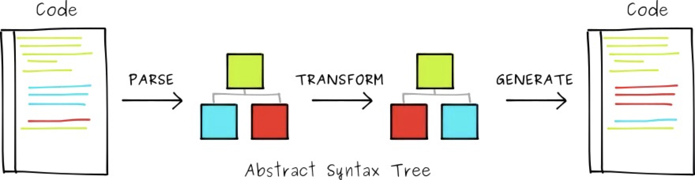
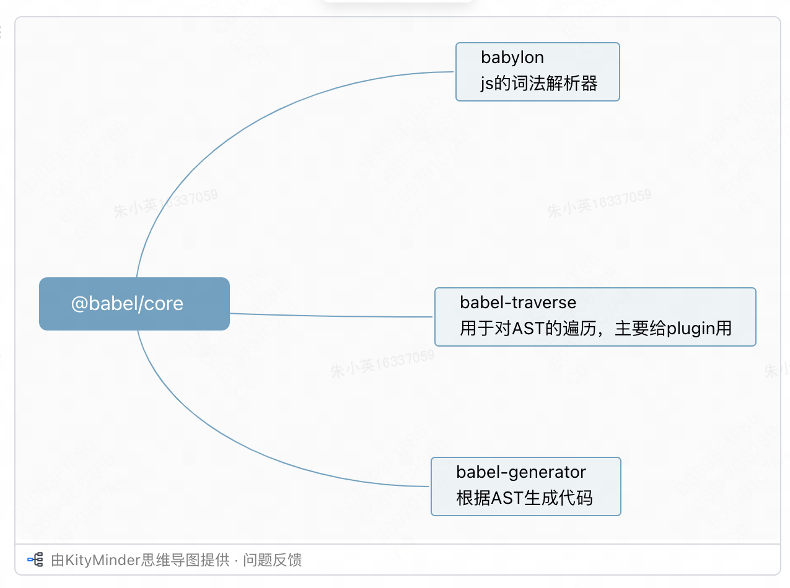

## 介绍

Babel is a JavaScript compiler，主要为了js在不同浏览器的兼容性，包括API和语法。

## 转换过程

解析 -> 转化 -> 生成





@babel/core依赖babylon完成js字符串到AST语法树的过程，再通过babel-traverse来遍历转译ATS得到新的抽象语法树，最后通过babel-generator完成AST到js字符串的过程，所以babel-core是依赖如上几个核心包完成转译生成的过程

## 插件介绍


## 依赖关系

在Webpack配置中使用的Babel相关插件和核心库之间存在着紧密且有序的关系。这些组件协同工作，共同实现将ES6+代码转译为向后兼容的JavaScript代码的目标，确保开发者能够利用最新的JavaScript语法进行开发，而不必担心兼容性问题。下面是这四种插件及核心库之间关系的详细说明：

1.@babel/core：
核心作用：Babel的核心库（@babel/core）提供了Babel转译器的基础API。它是Babel转译过程中不可或缺的部分，负责解析代码，进行转换，并生成最终的结果。
关系：它是所有Babel插件和预设工作的基础，其他的Babel相关工具（如@babel/cli、@babel/preset-env）都是建立在@babel/core之上的。

2.@babel/cli：
核心作用：@babel/cli是命令行下的Babel工具，它允许开发者在命令行中直接运行Babel转译过程。
关系：@babel/cli作为一个接口，直接调用@babel/core的API来执行转译任务。它便于在没有构建工具（如Webpack）的环境中使用Babel。

3.@babel/preset-env：
核心作用：@babel/preset-env是一个智能预设，能够根据配置的目标环境（浏览器、Node.js版本等）自动确定需要使用的Babel插件和polyfills。
关系：作为@babel/core的一个预设配置，@babel/preset-env简化了插件管理，开发者无需单独安装和配置大量的转译插件。它依赖于@babel/core来实现其功能。

4.babel-loader：
核心作用：babel-loader允许Webpack使用Babel进行文件的转译过程，特别是将JS文件从ES6+转译为兼容旧版浏览器的代码。
关系：babel-loader作为Webpack和Babel之间的桥梁，调用@babel/core的API进行代码转译。它在Webpack构建过程中，根据Webpack的配置（如module.rules中的设置），自动应用@babel/preset-env等Babel配置进行代码处理。

总之，@babel/core是核心，@babel/cli和@babel/preset-env是直接利用核心API的工具和配置，而babel-loader则是连接Webpack和Babel的桥梁，确保在Webpack构建过程中能够正确应用Babel的转译能力。

## plugin和preset区别

babel将很多的语法转换交给了一个个plugin处理，例如 @babel/plugin-transform-arrow-functions 这个插件可以转换箭头函数语法，但是为了不需要手动一个个添加，所以提供了@babel/preset-env，可以理解成preset包含了很多 plugin 。所以只需要配置一个 preset 就可以转换成浏览器支持的语法了。

* Presets是一组预定义的转换规则(plugins)集合，用于实现对特定环境或特性的转换，旨在简化配置过程。
* Plugins是独立的转换规则，用于对代码进行具体的转换，需要明确列出每个要应用的插件。

如果两个配置项同时存在的情况下，先执行plugin再执行preset，plugin按照顺序执行，preset按照逆序执行

```js
    {
      "plugins": ["Tom", "Jack"],
      "presets": ["a", "b", "c"]
    }
// 执行顺序 Tom Jack c b a
```

## corejs@2和corejs@3区别

core-js 是一个广泛使用的 JavaScript 标准库，用于提供对 ECMAScript 新特性和API的兼容性支持。core-js 分为不同的版本，其中 core-js@2 和 core-js@3 是两个主要版本。

1.模块结构和API变更

core-js@3 对模块结构进行了重组，移除了一些过时的 API，并引入了新的特性。
core-js@2 中一些已经被废弃的 API 在 core-js@3 中被移除。

2.支持的特性

core-js@3 添加了对 ES2019、ES2020 以及部分提案中的特性的支持。
core-js@2 支持的特性主要停留在 ES2015-ES2018。

3.更新和维护状态

core-js@3 是目前的主要版本，得到持续的更新和维护。
core-js@2 已经不再维护，不建议在新项目中使用。

4.兼容性和升级

从 core-js@2 升级到 core-js@3 需要进行代码的更改，因为一些导入路径和模块名称发生了变化。
core-js@3 提供了更好的平台兼容性和更现代的特性支持。

5.引入方式

core-js@3 引入特定的特性时，通常需要使用更精确的路径。
core-js@2 的引入路径相对更加简单。

## 配置方案对比

| 方案                                               | 优点               |   缺点                    |
|--------------------------------------------------|------------------|-------------------------|
| @babel/runtime & @babel/plugin-transform-runtime | 按需引入, 打包体积小      |  不能兼容实例方法               |
| @babel/polyfill                                  | 完整模拟 ES2015+ 环境  | 打包体积过大, 污染全局对象和内置的对象原型  |
| @babel/preset-env                                | 按需引入, 可配置性高      | --                      |

## 配置参考

```json
    //babel.config.json
    {
      "presets": ["@babel/preset-env"],
      "plugins": [
        [
          "@babel/plugin-transform-runtime",
          {
            // 不同版本区别后面会说
            "corejs": { "version": 3 }
          }
        ]
      ]
    }
```

## Babel7变更

* preset变更：淘汰es201x，删除stage-x，推荐env
* 废弃@babel/polyfill
* 包名称变化：把所有babel-*重命名为@babel/*
* 低版本node不再支持，不再支持nodejs 0.10, 0.12, 4, 5这四个版本，相当于要求nodejs >= 6

## 参考

[Node.js与Webpack中的Babel配置指南](https://juejin.cn/post/7345695255847878665?searchId=20240327104934EC1792762FD32461D4C8)
[一文掌握Babel来龙去脉、三大脚手架中使用Babel](https://juejin.cn/post/7284144079716728873?searchId=20240328111425B9210DD728AD18F0894D)
[【前端词典】关于 Babel 你必须知道的](https://juejin.cn/post/6844903894305210382?searchId=20240328111425B9210DD728AD18F0894D#heading-10)