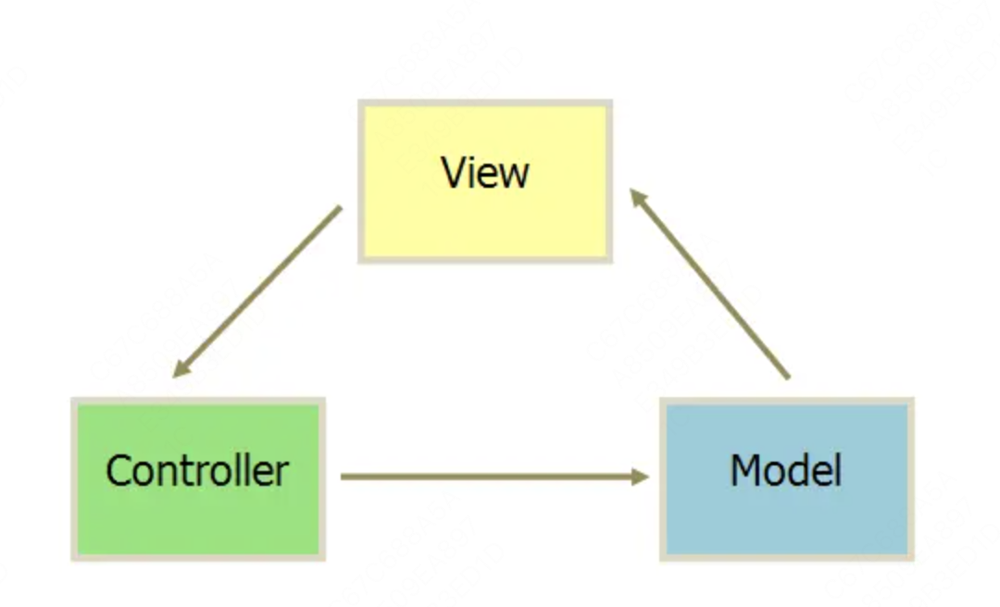
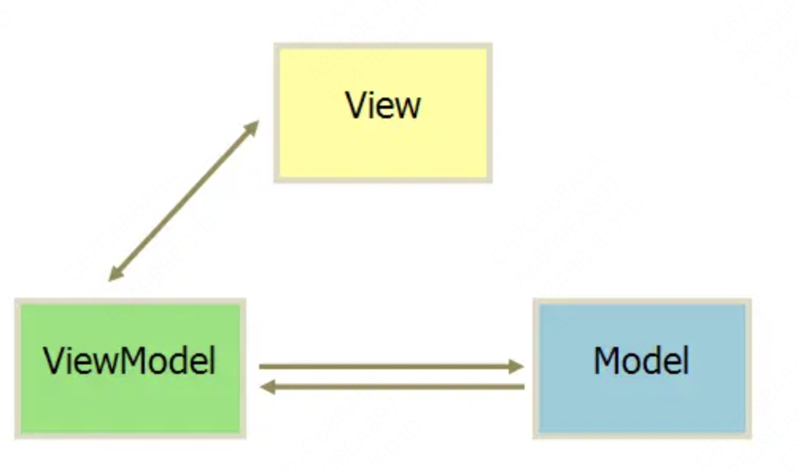

## MVVM、MVC、MVP的区别

MVC、MVP和MVVM是三种常见的软件架构设计模式，主要通过分离关注点的方式来组织代码结构，优化开发效率。

(1)MVC
MVC通过分离Model、View和Controller的方式来组织代码结构。其中View负责页面的显示逻辑，Model负责存储页面的业务数据以及对相应数据的操作。并且View和Model应用了观察者模式，当Model层发生改变的时候它会通知有关View层更新页面Controller层是View层和Model层的纽带，它主要负责用户与应用的响应操作，当用户与页面产生交互的时候，Controller中的事件触发器就开始工作了，通过调用Model层，来完成对Model的修改，然后Model层再去通知View层更新。



(2)MVVM
MVVM分为Model、View、ViewModel:
Model代表数据模型，数据和业务逻辑都在Model层中定义;
View代表UI视图，负责数据的展示;
ViewModel负责监听Model中数据的改变并且控制视图的更新，处理用户交互操作;
Model和View并无直接关联，而是通过ViewModel来进行联系的，Model和ViewModel之间有着双向数据绑定的联系。因此当Model中的数据改变时会触发View层的刷新，View中由于用户交互操作而改变的数据也会在Model中同步。
这种模式实现了Model和View的数据自动同步，因此开发者只需要专注于数据的维护操作即可，而不需要自己操作DOM。



(3)MVP
MVP模式与MVC唯一不同的在于Presenter和Controller。在MVC模式中使用观察者模式，来实现当Model层数据发生变化的时候，通知View层的更新。这样View层和Model层耦合在一起，当项目逻辑变得复杂的时候，可能会造成代码的混乱，并且可能会对代码的复用性造成一些问题。MVP的模式通过使用Presenter来实现对View层和Model层的解耦。MVC中的Controller只知道Model的接口，因此它没有办法控制View层的更新，MVP 模式中， View层的接口暴露给了Presenter因此可以在Presenter中将Model的变化和View的变化绑定在一起，以此来实现View和Model的同步更新。这样就实现了对View和Model的解耦，Presenter还包含了其他的响应逻辑。


## commonjs和esmodule区别

- commonJs是运行时加载，esModule是编译时运行
- commonJs输出的是值的拷贝，esModule输出的是值的引用
- esmodule是静态语法必须写在顶层，而commonjs是动态语法可以写在判断里
- esmodule的this是undefine,而commonjs的this是当前模块
- esmodue可以到处多个值，而commonjs是单个值导出

```js
// commonjs输出值拷贝
/*************** a.js**********************/
let count = 0
exports.count = count; // 输出值的拷贝
exports.add = ()=>{
    //这里改变count值，并不会将module.exports对象的count属性值改变
    count++
}

/*************** b.js**********************/
const { count, add } = require('./a.js')
//在支持es6模块的环境下等同于
import { count, add } from './a.js'

console.log(count) //0
add()
console.log(count)//0
```

```js
// esmodule输出值引用
/*************** a.js**********************/
export let count = 0;//输出的是值的引用，指向同一块内存
export const add = ()=>{
    count++;//此时引用指向的内存值发生改变
}


/*************** b.js**********************/
import { count, add } from './a.js'

console.log(count) //0
add()
console.log(count)//1
```

## ES模块中export出去的对象能被修改么？

在ES模块中，export出去的对象默认是只读的，不能被修改。当一个对象被导出后，在其他模块中引入该对象时，只能读取其属性和方法，而不能修改它们。

## ESModule和CommonJS分别是如何处理循环引用的？

ESModule:ES模块对循环引用有着严格的限制，当发生循环引用时，ES模块会将被引用的模块视为尚未准备好，因此会导致循环引用的模块导出一个空的对象或空值
CommonJS:在处理循环引用时更为宽松，它会在加载模块时记录模块的导出值，即使发生循环引用也不会导致问题。CommonJS模块系统允许循环引用中的模块导出部分已经准备好的值

## 参考

[架构之MVC、MVP、MVVM区别](https://juejin.cn/post/7348832432073015334?searchId=20240924230726D52CD301461F2A398B4A)
