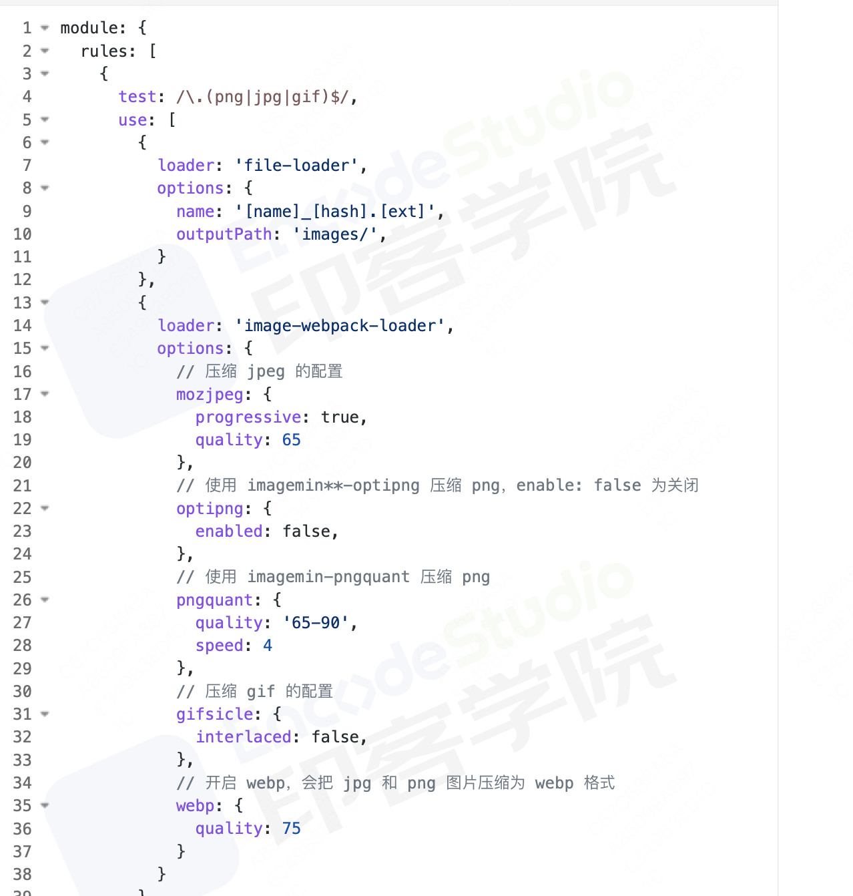

## 工程化

### development

- 框架选型
- 模块化+组件化
- 脚手架
- 本地开发服务
- mock服务

### 构建

- 打包、依赖、性能处理
- 缓存、增量更新、资源处理
- ES & babel | CSS && CSS processor
- 类库打包、工具资源的应用
- 构建性能优化

### 部署

- 持续部署
- nginx反向代理、SPA路由配置
- 跨域、HTTPS证书、流量
- 环境

### 性能和规范

- 缓存策略（强&弱缓存）
- CDN
- 请求优化
- 日志
- 预加载

## 打包产物

### commonjs

支持node

### esmodule

### umd

amd + commonjs + 全局

## browserslist配置

```js
{
    browserslist: {
          '> 0.5%',
          'last 2 versions',
          'safari >= 7',
          'Android >= 4.0',
          'ios >= 7',
          'not dead',
          'not op_mini all'
    }
}
```

### minify代码压缩

- 去除多余字符，例如空格
- 压缩变量名
- 逻辑解析，合并声明
- 预编译

```js
const a = 1
const b = 1 

// ===合并声明====
const a=1,b=2

function hello() {
    console.log(123)
}
hello() 

// ====预编译=====
console.log(123)
```

## 有哪些常见loader?分别有什么作用

- raw-loader: 加载文件原始内容
- file-loader: 把文件输出到文件夹中，在代码中通过相对url去引用输出的文件（图片，字体）
- url-loader: 与file-loader类似，区别是可以设置阈值，大于交给file-loader处理，小于则base64编码处理图片
- image-loader: 加载并压缩图片
- babel-loader: 将es6转换成es5
- ts-loader: 将ts转换成js
- sass-loader、less-loader: 转换成css
- css-loader: 加载css,即允许将css文件通过require的方式引入，并返回css代码
- style-loader: 将转换后的css以style标签的形式插入到页面中，但是一般都希望以文件的形式插入，这个时候会用到mini-css-exrta-plugin
- postcss-loader: 扩展css
- eslint-loader、ts-loader: 代码检查

```js
// 引入插件
const MiniCssExtractPlugin = require('mini-css-extract-plugin')
const config = {
  // ...
  module: { 
    rules: [
      // ...
      {
        test: /\.(s[ac]|c)ss$/i, //匹配所有的 sass/scss/css 文件
        use: [
          // 'style-loader',
          MiniCssExtractPlugin.loader, // 添加 loader
          'css-loader',
          'postcss-loader',
          'sass-loader', 
        ] 
      },
    ]
  },
  // ...
  plugins:[ // 配置插件
    // ...
    new MiniCssExtractPlugin({ // 添加插件
      filename: '[name].[hash:8].css'
    }),
    // ...
  ]
}

// ...

// 打包后的文件目录 
// dist                    
// ├─ avatar.d4d42d52.png  
// ├─ bundle.js            
// ├─ index.html           
// ├─ logo.56482c77.png    
// └─ main.3bcbae64.css # 生成的样式文件  

// html中以link的方式引入css文件
{/* <link href="main.3bcbae64.css" rel="stylesheet"> */}
```

## 有哪些常见的plugin?分别有什么作用

- define-plugin: 定义环境变量
- html-webpack-plugin: 简化html文件创建
- uglifyjs-webpack-plugin: 压缩js
- mini-css-extract-plugin: 分离样式文件，css提取为单独文件，支持按需加载
- clean-webpack-plugin: 目录清理
- webpack-bundle-analyzer: 可视化webpack输出文件体积
- speed-measure-webpack-plugin: 看到每个plugin、loader执行耗时

```js
const { DefinePlugin } = require('webpack')
module.exports = {
    ...,
    plugins: [
        new DefinePlugun({
            BASE_URL: './'
        })
    ]
}
```

## loader和plugin的区别

loader本质是函数，对接收到的内容进行转换，并且返回转换后的结果，因为webpack只认识js，所以loader就像当于翻译官，将其他类型的资源进行转换。
plugin是插件，基于事件流框架Tapable，扩展了webpack的能力，webpack运行生命周期中会广播很多事件,plugin会监听这些事件，在合适的时机通过Webpack提供的API改变输出结果。

## webpack构建流程简单说下？

Webpack的运行流程是一个串行的过程，从启动到结束会依次执行以下流程：

初始化参数：从配置文件和 Shell 语句中读取与合并参数，得出最终的参数
开始编译：用上一步得到的参数初始化Compiler对象，加载所有配置的插件，执行对象的run方法开始执行编译
确定入口：根据配置中的entry找出所有的入口文件
编译模块：从入口文件出发，调用所有配置的Loader对模块进行翻译，再找出该模块依赖的模块，再递归本步骤直到所有入口依赖的文件都经过了本步骤的处理
完成模块编译：在经过第4步使用Loader翻译完所有模块后，得到了每个模块被翻译后的最终内容以及它们之间的依赖关系
输出资源：根据入口和模块之间的依赖关系，组装成一个个包含多个模块的Chunk，再把每个Chunk转换成一个单独的文件加入到输出列表，这步是可以修改输出内容的最后机会
输出完成：在确定好输出内容后，根据配置确定输出的路径和文件名，把文件内容写入到文件系统

在以上过程中，Webpack会在特定的时间点广播出特定的事件，插件在监听到感兴趣的事件后会执行特定的逻辑，并且插件可以调用Webpack提供的API改变Webpack的运行结果。

## 使用webpack开发时，你用过哪些可以提高效率的插件？

webpack-dashboard：可以更友好的展示相关打包信息。
webpack-merge：提取公共配置，减少重复配置代码
speed-measure-webpack-plugin：简称 SMP，分析出 Webpack 打包过程中 Loader 和 Plugin 的耗时，有助于找到构建过程中的性能瓶颈。
size-plugin：监控资源体积变化，尽早发现问题
HotModuleReplacementPlugin：模块热替换

## 说一下Webpack的热更新原理吧

Webpack 的热更新又称热替换（Hot Module Replacement），缩写为HMR。 这个机制可以做到不用刷新浏览器而将新变更的模块替换掉旧的模块。
HMR的核心就是客户端从服务端拉去更新后的文件，准确的说是 chunk diff (chunk 需要更新的部分)，实际上 WDS 与浏览器之间维护了一个 Websocket，当本地资源发生变化时，WDS 会向浏览器推送更新，并带上构建时的 hash，让客户端与上一次资源进行对比。客户端对比出差异后会向 WDS 发起 Ajax 请求来获取更改内容(文件列表、hash)，这样客户端就可以再借助这些信息继续向 WDS 发起 jsonp 请求获取该chunk的增量更新。
后续的部分(拿到增量更新之后如何处理？哪些状态该保留？哪些又需要更新？)由 HotModulePlugin 来完成，提供了相关 API 以供开发者针对自身场景进行处理，像react-hot-loader 和 vue-loader 都是借助这些 API 实现 HMR。

## 如何对bundle体积进行监控和分析

VSCode中有一个插件Import Cost可以帮助我们对引入模块的大小进行实时监测，还可以使用webpack-bundle-analyzer生成 bundle 的模块组成图，显示所占体积。
bundlesize工具包可以进行自动化资源体积监控。

## 文件指纹是什么？怎么用？

文件指纹是打包后输出的文件名的后缀。

Hash：和整个项目的构建相关，只要项目文件有修改，整个项目构建的hash值就会更改
Chunkhash：文件的改动只会影响其所在的chunk的hash
Contenthash：根据文件内容来定义hash，文件内容不变，则contenthash不变

JS的文件指纹设置

```js
// 设置output的filename，用chunkhash。
module.exports = {
    entry: { app: "./scr/app.js", search: "./src/search.js" },
    output: { filename: "[name][chunkhash:8].js", path: __dirname + "/dist" },
}
```

CSS的文件指纹设置

```js
// 设置 MiniCssExtractPlugin 的 filename，使用 contenthash。
module.exports = {
    entry: { app: "./scr/app.js", search: "./src/search.js" },
    output: { filename: "[name][chunkhash:8].js", path: __dirname + "/dist" },
    plugins: [new MiniCssExtractPlugin({ filename: `[name][contenthash:8].css` })],
}
```

图片的文件指纹设置

设置file-loader的name，使用hash。
占位符名称及含义

ext资源后缀名
name文件名称
path文件的相对路径
folder文件所在的文件夹
contenthash文件的内容hash，默认是md5生成
hash文件内容的hash，默认是md5生成
emoji 一个随机的指代文件内容的emoj

```js
const path = require("path")
module.exports = {
    entry: "./src/index.js",
    output: { filename: "bundle.js", path: path.resolve(__dirname, "dist") },
    module: {
        rules: [
            {
                test: /\.(png|svg|jpg|gif)$/,
                use: [{ loader: "file-loader", options: { name: "img/[name][hash:8].[ext]" } }],
            },
        ],
    },
}
```

## 如何优化Webpack的构建速度？

### 使用高版本的Webpack和Node.js

## 多进程/多实例构建

HappyPack(不维护了,webpack5弃用)、thread-loader

```js
const path = require('path');

// 路径处理方法
function resolve(dir){
  return path.join(__dirname, dir);
}

const config = {
  //...
  module: { 
    noParse: /jquery|lodash/,
    rules: [
      {
        test: /\.js$/i,
        include: resolve('src'),
        exclude: /node_modules/,
        use: [
          {
            loader: 'thread-loader', // 开启多进程打包
            options: {
              worker: 3,
            }
          },
          'babel-loader',
        ]
      },
      // ...
    ]
  }
};
```

### externals

externals配置选项提供了「从输出的 bundle 中排除依赖」的方法。此功能通常对library开发人员来说是最有用的，然而也会有各种各样的应用程序用到它。例如jquery包直接引用cdn链接

### 压缩代码

开启并行js压缩、并行css压缩、html压缩
生产环境默认使用`terser-webpack-plugin`压缩js代码，也可以自定义配置

```js
const TerserPlugin = require('terser-webpack-plugin')
const CssMinimizerPlugin = require('css-minimizer-webpack-plugin')
const HtmlWebpackPlugin = require('html-webpack-plugin')
module.exports = {
    ...,
    optimization: {
        minimize: true,
        minimizer: [new TerserPlugin({
            parallel: true // 使用多进程并发运行提高构建速度，默认为true，并发数量为电脑cpu数 - 1
        }), new CssMinimizerPlugin({
            parallel: true
        }), new HtmlWebpackPlugin({
            ...,
            minify: {
                minifyCSS:false, // 是否压缩css
                collapseWhitespace:false, // 是否折叠空格
                removeComments:true // 是否移除注释
            } // 设置了minify，实际上会使用另一个插件html-minifier-terser
        })]
    }
}
```

### 图片压缩

使用基于Node库的imagemin(很多定制选项、可以处理多种图片格式)
配置image-webpack-loader



### 缩小打包作用域

exclude/include(确定loader规则范围)
resolve.modules指明第三方模块的绝对路径(减少不必要的查找)
resolve.mainFields只采用main字段作为入口文件描述字段(减少搜索步骤，需要考虑到所有运行时依赖的第三方模块的入口文件描述字段)resolve.extensions尽可能减少后缀尝试的可能性
resolve.alias合理使用alias
noParse对完全不需要解析的库进行忽略 (不去解析但仍会打包到bundle中，注意被忽略掉的文件里不应该包含import、require、define 等模块化语句)
IgnorePlugin (完全排除模块)

```js
const path = require('path')
...
// 路径处理方法
function resolve(dir){
  return path.join(__dirname, dir);
}

 const config  = {
  ...
  resolve:{
    extensions: ['ts', '.js', '.json'],
    // 配置别名
    alias: {
      '~': resolve('src'),
      '@': resolve('src'),
      'components': resolve('src/components'),
    },
    // 用于配置webpack去哪些目录下寻找第三方模块，默认值为`['node_modules']`，当安装的第三方模块都放在项目根目录下的./node_modules目录下时，可以指明存放第三方模块的绝对路径
    modules: [path.resolve(__dirname, 'node_modules')]
  },
   modules: { 
    noParse: /jquery|lodash/,
    rules:[...]
  }
};
```

### 提取页面公共资源

基础包分离：

使用 html-webpack-externals-plugin，将基础包通过 CDN 引入，不打入 bundle 中使用 SplitChunksPlugin 进行(公共脚本、基础包、页面公共文件)分离(Webpack4内置) ，替代了 CommonsChunkPlugin 插件

### DLL

使用DllPlugin进行分包，使用 DllReferencePlugin(索引链接) 对 manifest.json 引用，让一些基本不会改动的代码先打包成静态资源，避免反复编译浪费时间。HashedModuleIdsPlugin 可以解决模块数字id问题

## 充分利用缓存提升二次构建速度

babel-loader开启缓存terser-webpack-plugin
开启缓存使用cache-loader或者hard-source-webpack-plugin

### Tree shaking

打包过程中检测工程中没有引用过的模块并进行标记，在资源压缩时将它们从最终的bundle中去掉(只能对ES6 Modlue生效) 开发中尽可能使用ES6 Module的模块，提高tree shaking效率
禁用babel-loader的模块依赖解析，否则Webpack接收到的就都是转换过的CommonJS形式的模块，无法进行tree-shaking
使用PurifyCSS(不在维护)或者uncss去除无用CSS代码

purgecss-webpack-plugin 和 mini-css-extract-plugin配合使用(建议)

js的tree-shaking方法有两种配置：usedExports、sideEffects

```js
module.exports = {
    ...,
    optimization: {
        usedExports: true
    }
}
```

css的tree-shaking使用purgecss-webpack-plugin

### Scope hoisting

构建后的代码会存在大量闭包，造成体积增大，运行代码时创建的函数作用域变多，内存开销变大。Scope hoisting 将所有模块的代码按照引用顺序放在一个函数作用域里，然后适当的重命名一些变量以防止变量名冲突必须是ES6的语法，因为有很多第三方库仍采用 CommonJS 语法，为了充分发挥 Scope hoisting 的作用，需要配置 mainFields 对第三方模块优先采用 jsnext:main 中指向的ES6模块化语法

### 动态Polyfill

建议采用 polyfill-service 只给用户返回需要的polyfill，社区维护。 (部分国内奇葩浏览器UA可能无法识别，但可以降级返回所需全部polyfill)

### 利用缓存

babel-loader开启缓存
babel在转译js过程中时间开销比价大，将 babel-loader 的执行结果缓存起来，重新打包的时候，直接读取缓存
缓存位置： `node_modules/.cache/babel-loader`

```js
const config = {
 module: { 
    noParse: /jquery|lodash/,
    rules: [
      {
        test: /\.js$/i,
        include: resolve('src'),
        exclude: /node_modules/,
        use: [
          // ...
          {
            loader: 'babel-loader',
            options: {
              cacheDirectory: true // 启用缓存
            }
          },
        ]
      },
      // ...
    ]
  }
}
```

cache-loader
缓存一些性能开销比较大的 loader 的处理结果
缓存位置：`node_modules/.cache/cache-loader`

```js
const config = {
 module: { 
    // ...
    rules: [
      {
        test: /\.(s[ac]|c)ss$/i, //匹配所有的 sass/scss/css 文件
        use: [
          // 'style-loader',
          MiniCssExtractPlugin.loader,
          'cache-loader', // 获取前面 loader 转换的结果
          'css-loader',
          'postcss-loader',
          'sass-loader', 
        ]
      }, 
      // ...
    ]
  }
}
```

## 代码分割的本质是什么？有什么意义呢？

代码分割的本质其实就是在源代码直接上线和打包成唯一脚本main.bundle.js这两种极端方案之间的一种更适合实际场景的中间状态

## webpack的热更新原理

模块热替换(HMR - hot module replacement)，又叫做热更新，在不需要刷新整个页面的同时更新模块，能够提升开发的效率和体验。热更新时只会局部刷新页面上发生了变化的模块，同时可以保留当前页面的状态，比如复选框的选中状态等。
热更新的核心就是客户端从服务端拉去更新后的文件，准确的说是 chunk diff (chunk 需要更新的部分)，实际上webpack-dev-server与浏览器之间维护了一个websocket，当本地资源发生变化时，webpack-dev-server会向浏览器推送更新，并带上构建时的hash，让客户端与上一次资源进行对比。客户端对比出差异后会向webpack-dev-server发起 Ajax 请求来获取更改内容(文件列表、hash)，这样客户端就可以再借助这些信息继续向webpack-dev-server发起 jsonp 请求获取该chunk的增量更新。
后续的部分(拿到增量更新之后如何处理？哪些状态该保留？哪些又需要更新？)由HotModulePlugin 来完成，提供了相关 API 以供开发者针对自身场景进行处理，像react-hot-loader和vue-loader都是借助这些 API 实现热更新

## Babel原理

解析：将代码转换成AST

词法分析：将代码(字符串)分割为token流，即语法单元成的数组语法分析：分析token流(上面生成的数组)并生成 AST
转换：访问AST的节点进行变换操作生产新的 AST

Taro就是利用babel完成的小程序语法转换
生成：以新的AST为基础生成代码

## tree shaking原理

其原理主要基于ES6模块的静态结构特性和标记未使用的模块变量，具体包括以下几个步骤：
第一步，主要是做静态分析。在Webpack构建过程中，它会对所有模块的依赖关系进行静态分析。它会构建一个依赖图，其中包括各个模块之间的依赖关系。
第二步，主要是标记未使用代码。在分析期间，Webpack会通过识别导入语句和变量是否被引用，从而判断出是否被使用，如果一个模块的导出在整个应用程序中未被引用，那么这个模块就会被标记为未使用。
第三步，生成输出文件。Webpack会根据标记的结果生成最终的输出文件。在输出文件中，未使用的模块和导出将被移除，从而减小打包产物的大小。

## 如何编写plugin

首先，需要创建一个插件对象，并在其中定义一个apply方法，在apply方法中，可以通过compiler实例注册不同阶段的钩子，并在钩子函数中实现逻辑

```js
class MyPlugin {
    // Webpack会调用MyPlugin实例的apply方法给插件实例传入compiler对象
  apply (compiler) {
    compiler.hooks.emit.tap('MyPlugin', compilation => { 
    // compilation: 当前打包构建流程的上下文
    console.log(compilation); 
    // do something...
    })
  }
}
```

## 参考

[再来一打Webpack面试题](https://juejin.cn/post/6844904094281236487)
[2024前端高频面试题之-- 前端工程化篇](https://juejin.cn/post/7350535815132659749?searchId=20240907233332DD543BD144E65D47DE2B)
[透过分析 webpack 面试题，构建 webpack5.x 知识体系](https://juejin.cn/post/7023242274876162084?searchId=20240908141934117D24543A0586AB3571)